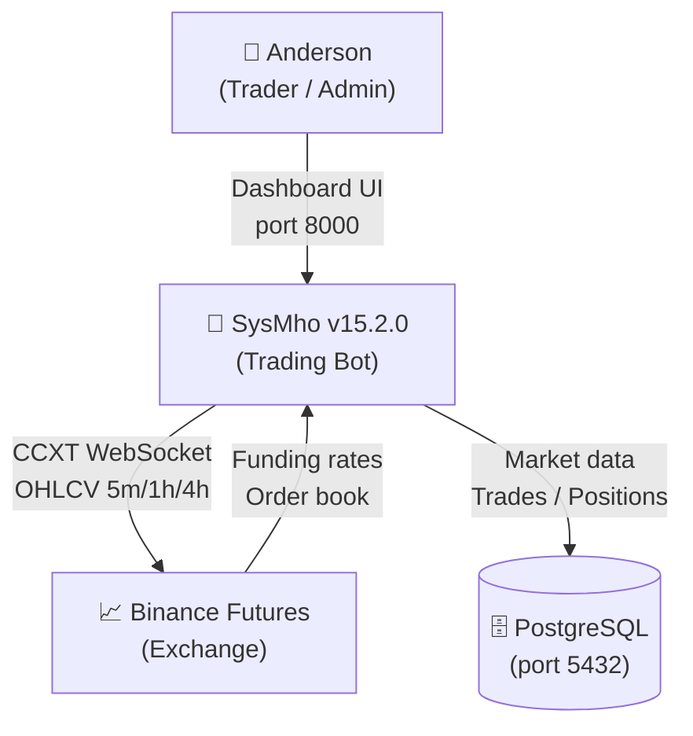
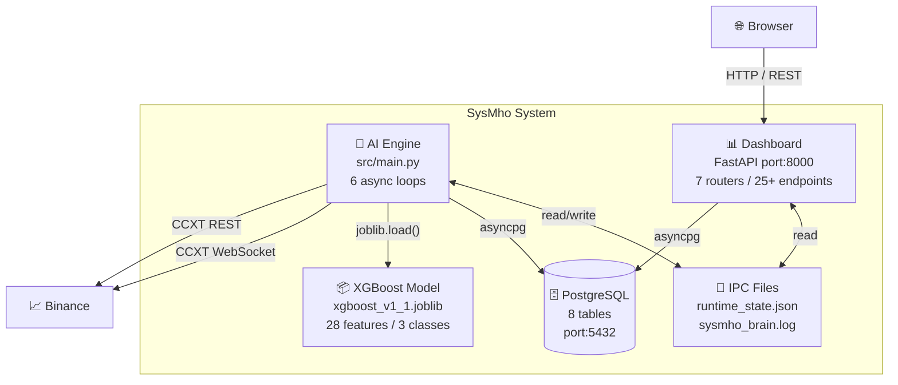

# sysmho-docs — Documentación Profesional Completa

Genera **16 archivos de documentación real** listos para leer, no reportes ni scaffolding.
Extrae contenido directamente del codebase y aplica estándares del mundo laboral.

---

## Estándares Aplicados

| Estándar | Origen | Aplica a |
|----------|--------|----------|
| **Diátaxis** | Daniele Procida / Django, Ubuntu | Organización en cuadrantes (Tutorial/How-to/Reference/Explanation) |
| **ADR** | Michael Nygard / ThoughtWorks, Amazon | Decisiones arquitectónicas con contexto real |
| **Keep a Changelog** | keepachangelog.com / OSS global | CHANGELOG.md semver |
| **OpenAPI 3.0** | OpenAPI Initiative / Linux Foundation | API Reference completa |
| **C4 Model** | Simon Brown / Spotify, ING Bank | Diagramas arquitectura Mermaid |
| **RFC-style** | IETF / Google, Stripe interno | Especificaciones técnicas ML pipeline |

---

## Output Esperado

```
docs/
├── adr/
│   ├── ADR-001-xgboost-architecture.md
│   ├── ADR-002-sliding-window-training.md
│   ├── ADR-003-circuit-breaker-pattern.md
│   ├── ADR-004-asyncpg-async-first.md
│   ├── ADR-005-api-key-auth.md
│   └── ADR-006-meta-evaluator-design.md
├── how-to/
│   ├── HOW-TO-retrain-model.md
│   ├── HOW-TO-deploy.md
│   ├── HOW-TO-add-symbol.md
│   └── HOW-TO-tune-circuit-breaker.md
├── specs/
│   └── SPEC-001-ml-prediction-pipeline.md
├── API_REFERENCE.md
├── ARCHITECTURE.md
├── CHANGELOG.md
├── CONFIGURATION.md
└── DOC_HEALTH_REPORT.md
```

---

## Paso 1 — Setup

```bash
mkdir -p docs/adr docs/how-to docs/specs
```

Confirmar: `ls docs/`

---

## Paso 2 — ADR Generation (Michael Nygard Format)

Leer antes de escribir:
```
Read src/constants.py
Read src/executor/circuit_breaker.py
Read src/ai/meta_evaluator.py
Read CLAUDE.md
```

Generar los 6 ADRs con este formato exacto:

```markdown
# ADR-NNN: Título

**Date:** YYYY-MM-DD
**Status:** Accepted
**Deciders:** Anderson

## Context
[Por qué se necesitaba esta decisión — problema real del sistema]

## Decision
[Qué se decidió hacer exactamente]

## Consequences
### Positivas
- ...
### Negativas / Trade-offs
- ...
### Deuda Técnica
- ...
```

### ADR-001: XGBoost como Motor de Predicción
- **Context:** Se necesitaba clasificar señales 5m con latencia <10ms y accuracy >85%. Alternativas evaluadas: LSTM (alta latencia, overfitting en datasets pequeños), Random Forest (sin calibración de probabilidades), reglas estáticas (no adaptan al mercado).
- **Decision:** XGBoost multiclass (SELL=0, WAIT=1, BUY=2) con 28 features normalizadas. Entrenado con TimeSeriesSplit (5 folds, sin shuffle). Parámetros Optuna: n_estimators=235, lr=0.1259, max_depth=5.
- **Consequences +:** <10ms por predicción, probabilidades calibradas, feature importance interpretable.
- **Consequences -:** Sin adaptación online (requiere retraining periódico), no captura secuencias temporales largas.

### ADR-002: Sliding Window de 3 Meses
- **Context:** Mercado cripto cambia régimen (bull/bear/sideways) cada 2-3 meses. Entrenar con todo el histórico hace que patrones viejos "contaminen" el modelo con contextos irrelevantes.
- **Decision:** `TRAINING_WINDOW_MONTHS = 3` → 25,920 velas 5m (30 días × 24h × 12 velas/h × 3 meses). Implementado en `src/ai/trainers/sequential.py`.
- **Consequences +:** Modelo adaptable al régimen actual, dataset manejable.
- **Consequences -:** Pierde memoria de patrones >3 meses. Requiere retraining frecuente (cada 1-2 semanas).

### ADR-003: Circuit Breaker Pattern para Protección de Capital
- **Context:** En modo autónomo, el sistema ejecuta trades sin intervención humana. Sin límites duros, una racha de pérdidas o alta volatilidad podría liquidar la cuenta.
- **Decision:** 5 hard stops implementados en `src/executor/circuit_breaker.py`: drawdown diario ≥4% (`CB_DAILY_LOSS_PCT`), drawdown semanal ≥8% (`CB_WEEKLY_DRAWDOWN_PCT`), pérdidas consecutivas ≥3 (`CB_MAX_CONSEC_LOSSES`), posiciones abiertas ≥3 (`CB_MAX_OPEN_POSITIONS`), trades/día ≥8 (`CB_MAX_DAILY_TRADES`). Todos configurables en `.env`.
- **Consequences +:** Capital protegido en escenarios adversos. Configurable sin reinicio via `.env`.
- **Consequences -:** Puede frenar en mercados volátiles legítimos. Requiere calibración periódica.

### ADR-004: Async-First con asyncpg
- **Context:** El engine maneja 30 WebSocket feeds simultáneos (10 símbolos × 3 timeframes) + operaciones de BD. Un modelo síncrono bloquearía el event loop durante I/O.
- **Decision:** `asyncpg` directo (sin ORM overhead) para BD. `asyncio.create_subprocess_exec` para subprocesos. Todas las funciones que tocan BD/red son `async def`. `DatabaseRepository` con pool de conexiones (`asyncpg.create_pool`).
- **Consequences +:** No bloquea event loop, máximo throughput con recursos limitados.
- **Consequences -:** Más verbose que ORM síncrono, no soporta migraciones automáticas (requiere Alembic o SQL manual).

### ADR-005: X-API-Key para Autenticación del Dashboard
- **Context:** Dashboard single-admin (solo Anderson). No hay multi-tenancy. JWT sería overhead sin beneficio real para un sistema de un solo usuario.
- **Decision:** Header `X-API-Key` validado en middleware FastAPI. Si `DASHBOARD_API_KEY` está vacío en `.env` → acceso abierto (development). Si está definido → rechaza con 403. Implementado en `src/dashboard/api.py`.
- **Consequences +:** Simple, sin tokens que expirar, perfecto para single-admin.
- **Consequences -:** No soporta múltiples usuarios ni roles. Si se migra a multi-user, requiere reescritura de auth.

### ADR-006: MetaEvaluador como Segunda Capa Estadística
- **Context:** XGBoost con alta accuracy (~98%) aún tomaba malas decisiones en contextos específicos: horas UTC de alta volatilidad (14-17 UTC), direcciones con historial negativo en cierto símbolo, o cuando la confianza estaba mal calibrada.
- **Decision:** `MetaEvaluator` en `src/ai/meta_evaluator.py` con 5 componentes: (1) win rate global por símbolo, (2) win rate por hora UTC + dirección, (3) calibración de confianza por bucket, (4) penalización por racha de pérdidas, (5) confianza base del modelo. Umbral dinámico: `meta_score ≥ 0.52` (sube hasta 0.75 si WR baja). Ventana destructiva 14-17 UTC: +0.08 al umbral.
- **Consequences +:** Reduce trades en contextos estadísticamente malos. Aprende con cada trade via `SelfLearner`.
- **Consequences -:** Requiere ≥10 trades por símbolo para activarse. Los primeros 10 trades van sin filtro MetaEvaluador.

```bash
# Escribir los 6 ADRs:
Write docs/adr/ADR-001-xgboost-architecture.md
Write docs/adr/ADR-002-sliding-window-training.md
Write docs/adr/ADR-003-circuit-breaker-pattern.md
Write docs/adr/ADR-004-asyncpg-async-first.md
Write docs/adr/ADR-005-api-key-auth.md
Write docs/adr/ADR-006-meta-evaluator-design.md
```

---

## Paso 3 — CHANGELOG (Keep a Changelog v1.0.0)

```bash
git log --oneline --decorate | head -80
git tag --sort=-version:refname | head -10
```

Generar `docs/CHANGELOG.md` agrupando commits por versión semver. Formato:

```markdown
# Changelog
All notable changes to SysMho are documented here.

Format: [Keep a Changelog](https://keepachangelog.com/en/1.0.0/)
Versioning: [Semantic Versioning](https://semver.org/spec/v2.0.0.html)

## [Unreleased]

## [15.2.0] - 2026-04-04
### Added
- Gap Filler automático al arranque (src/collector/gap_filler.py)
- PnL diario con reset manual desde dashboard
- Docker-first deployment (uv run db-start-docker)

### Changed
- XGBoost v3: 28 features (symbol_encoded + contexto macro 1h/4h)
- Sliding window retrain: ventana 3 meses configurable

### Fixed
- Race condition en position monitor
- Side detection bug en señales BOUNTY

## [15.0.0] - 2026-03-29
### Added
- Modo autónomo con MetaEvaluador (5 filtros estadísticos)
- Circuit Breaker automático (5 hard stops)
- SelfLearner: actualización meta_stats.json post-trade
- Autonomous decisions log en BD

### Changed
- Pipeline ML: 27 features → 28 features
```

```bash
Write docs/CHANGELOG.md
```

---

## Paso 4 — API Reference (OpenAPI 3.0 Inspired)

Leer todos los routers:
```
Read src/dashboard/api.py
Read src/dashboard/routes/system.py
Read src/dashboard/routes/market.py
Read src/dashboard/routes/signals.py
Read src/dashboard/routes/positions.py
Read src/dashboard/routes/portfolio.py
Read src/dashboard/routes/autonomous.py
Read src/dashboard/routes/testing.py
```

Generar `docs/API_REFERENCE.md` con este formato por endpoint:

```markdown
# SysMho API Reference
**Base URL:** `http://localhost:8000`
**Authentication:** `X-API-Key: <your-key>` header (set in `.env` as `DASHBOARD_API_KEY`)
If `DASHBOARD_API_KEY` is empty → open access (development mode)

---

## System

### GET /api/system/status
Verifies live Binance connection.

**Auth:** Required
**Response 200:**
```json
{"status": "ACTIVE", "latency_ms": 45}
```
**Errors:** 403 Invalid API Key, 500 Binance unreachable

**Example:**
```bash
curl -H "X-API-Key: your-key" http://localhost:8000/api/system/status
```
```

Cubrir los 7 routers con todos sus endpoints:
- **System** (6): status, last_scan, data_freshness, db_status, sync_status, logs
- **Market** (1): market_data/{symbol_encoded}
- **Signals** (5): pending_signals, approve, reject, dismiss_all, authorized_history
- **Positions** (2): positions, close position
- **Portfolio** (6): balance, stats, trades_history, transfer_to_reserve, reset_pnl, adjust_capital
- **Autonomous** (4): status, decisions, toggle, reset_cb
- **Testing** (1): inject_signal

```bash
Write docs/API_REFERENCE.md
```

---

## Paso 5 — ARCHITECTURE.md (C4 Model con Mermaid)

Leer para datos reales:
```
Read src/AGENTS.md
Read src/main.py   (primeras 80 líneas)
Read src/database/schema.sql
```

Generar `docs/ARCHITECTURE.md`:

```markdown
# SysMho Architecture — C4 Model

## Level 1 — System Context



## Level 2 — Containers



## Level 3 — ML Prediction Pipeline

Flujo completo desde datos hasta ejecución:

```
Binance WebSocket (10 símbolos × 3 timeframes = 30 feeds)
    ↓
market_data (PostgreSQL) — OHLCV candles [5m, 1h, 4h]
    ↓
FeatureEngineer.get_master_dataframe()  [src/analysis/features.py]
    ├── TechnicalIndicators: RSI, MACD, ADX, BB, ATR, EMA21, EMA200, VWAP, Stoch
    ├── Macro context: merge_asof() 1h → 5m, 4h → 5m (5 features cada uno)
    ├── Sentiment: funding_rate + obi_20 (sentiment_data tabla)
    ├── Swarm: swarm_rsi_avg, swarm_macd_avg, swarm_bull_ratio (10 activos)
    └── Identity: symbol_encoded (estable: BTC=0..POL=9)
    = 28 features totales normalizadas
    ↓
ModelPredictor.predict_signal()  [src/ai/predictor.py]
    ├── XGBoost.predict_proba() → [p_SELL, p_WAIT, p_BUY]
    ├── Filtro inercia: p_WAIT > 72% → WAIT (veto)
    ├── Clase dominante: max(p_BUY, p_SELL)
    ├── Ratio fuerza: dominante/opuesta ≥ 2.0
    └── Confianza mínima: ≥ 38% → BUY/SELL, else WAIT
    = {signal, confidence, signal_type: PREMIUM/STANDARD/AGGRESSIVE}
    ↓
RiskManager.evaluate_signal()  [src/risk/manager.py]
    ├── Position sizing: 2% capital (NORMAL) / 5% (AGGRESSIVE)
    ├── Notional cap: max 12% capital por trade
    ├── Exposure limit: alerta si >50% capital en posiciones
    └── SL/TP: ATR×1.5 / ATR×3.0 (NORMAL)
    ↓
┌─────── MODO MANUAL ──────────────────────────────┐
│  pending_approvals (BD) → Dashboard UI           │
│  Anderson: APPROVE / REJECT (timeout: 5 min)     │
└──────────────────────────────────────────────────┘
        ─ ó ─
┌─────── MODO AUTÓNOMO ────────────────────────────┐
│  MetaEvaluator.evaluate()  [src/ai/meta_evaluator.py]
│    ├── Win rate global símbolo (si total ≥ 10)
│    ├── Win rate por hora UTC + dirección (si ≥ 5)
│    ├── Calibración confianza (bucket 0.05)
│    ├── Racha pérdidas (-8% por pérdida extra)
│    └── Confianza base modelo
│    = meta_score ≥ 0.52 → APPROVED
│  CircuitBreaker.check()  [src/executor/circuit_breaker.py]
│    └── 5 hard stops → BLOCKED si cualquiera se activa
└──────────────────────────────────────────────────┘
    ↓
TradeExecutor.execute_trade()  [src/executor/trader.py]
    └── CCXT: create_order(symbol, type, side, amount) → Binance Futures
    ↓
PositionMonitor.run()  [src/executor/monitor.py]
    └── Sync SL/TP cada 1 segundo desde Binance
    ↓
SelfLearner.update(trade)  [src/ai/self_learner.py]
    └── Actualiza meta_stats.json: win_rate global + by_hour + calibración
```

## Database Schema

| Tabla | Propósito | Filas típicas |
|-------|-----------|---------------|
| `market_data` | OHLCV candles (5m/1h/4h) | ~1M+ |
| `sentiment_data` | Funding rate + OBI por símbolo | 10 |
| `trades` | Historial completo de operaciones | creciente |
| `positions` | Posiciones abiertas activas | 0-3 |
| `pending_approvals` | Señales pendientes + historial | creciente |
| `portfolio` | Snapshots de balance | creciente |
| `risk_log` | Rechazos del risk manager | creciente |
| `model_performance` | Métricas de cada retraining | creciente |
```

```bash
Write docs/ARCHITECTURE.md
```

---

## Paso 6 — CONFIGURATION.md

Leer:
```
Read src/constants.py
Read .env.example
```

Generar `docs/CONFIGURATION.md` con todas las variables:

```markdown
# SysMho Configuration Reference

## Environment Variables (.env)

| Variable | Default | Required | Description |
|----------|---------|----------|-------------|
| `BINANCE_API_KEY` | — | ✅ | Binance Futures API Key |
| `BINANCE_SECRET_KEY` | — | ✅ | Binance Futures Secret Key |
| `BINANCE_TESTNET` | `True` | — | `True` = testnet, `False` = mainnet real |
| `DB_HOST` | `localhost` | — | PostgreSQL host |
| `DB_PORT` | `5432` | — | PostgreSQL port |
| `DB_USER` | `postgres` | — | PostgreSQL user |
| `DB_PASSWORD` | `changeme` | — | PostgreSQL password |
| `DB_NAME` | `sysmho` | — | PostgreSQL database name |
| `AUTONOMOUS_MODE` | `false` | — | `true` activa MetaEvaluador como decisor |
| `LEARNING_LOOP_SECONDS` | `60` | — | Intervalo del learning loop |
| `DASHBOARD_API_KEY` | `` (vacío) | — | Si está vacío: acceso abierto. Si está definido: requiere header |
| `META_SCORE_THRESHOLD` | `0.52` | — | Score mínimo MetaEvaluador para aprobar |
| `META_MIN_TRADES` | `10` | — | Trades mínimos para activar filtro por símbolo |
| `META_MIN_FOR_MODEL` | `200` | — | Trades para Phase 2 meta-model |
| `CB_MAX_POSITIONS` | `3` | — | Max posiciones abiertas simultáneas |
| `CB_MAX_DAILY_TRADES` | `8` | — | Max trades por día |
| `CB_MAX_CONSEC_LOSSES` | `3` | — | Max pérdidas consecutivas antes de CB |
| `CB_DAILY_LOSS_PCT` | `0.04` | — | Drawdown diario máximo (4%) |
| `CB_WEEKLY_DRAWDOWN_PCT` | `0.08` | — | Drawdown semanal máximo (8%) |

## Predictor Thresholds (src/constants.py)

| Constante | Valor | Descripción |
|-----------|-------|-------------|
| `NORMAL_INERTIA_THRESHOLD` | `0.72` | Si p(WAIT) > 72% → veto señal |
| `NORMAL_MIN_CONFIDENCE` | `0.38` | Confianza mínima para señal válida |
| `NORMAL_STRENGTH_RATIO` | `2.0` | dominante/opuesta ≥ 2.0 |
| `HIGH_CONVICTION_THRESHOLD` | `0.55` | Confianza ≥ 55% = PREMIUM (BOUNTY) |
| `AGGRESSIVE_MIN_CONFIDENCE` | `0.05` | Threshold agresivo (modo BOUNTY override) |

## Training Parameters

| Constante | Valor | Descripción |
|-----------|-------|-------------|
| `TRAINING_WINDOW_MONTHS` | `3` | Sliding window: últimos 3 meses |
| `LABEL_THRESHOLD` | `0.007` | 0.7% movimiento = señal válida BUY/SELL |
| `TRAIN_TEST_SPLIT` | `0.15` | 15% hold-out para validación final |
| `MIN_CANDLES_FOR_TRAINING` | `1000` | Mínimo de velas para entrenar un símbolo |

## Risk Parameters

| Constante | Valor | Descripción |
|-----------|-------|-------------|
| `NORMAL_RISK_PER_TRADE` | `0.02` | 2% del capital por trade (NORMAL) |
| `AGGRESSIVE_RISK_PER_TRADE` | `0.05` | 5% del capital por trade (AGGRESSIVE) |
| `NOTIONAL_CAP_RATIO` | `0.12` | Max 12% del capital por posición |
| `EXPOSURE_LIMIT_RATIO` | `0.50` | Alerta si >50% capital en posiciones |
| `NORMAL_ATR_SL` | `1.5` | Stop-loss = ATR × 1.5 |
| `NORMAL_ATR_TP` | `3.0` | Take-profit = ATR × 3.0 (R/R = 2.0) |

## Temporal Windows

| Constante | Valor | Descripción |
|-----------|-------|-------------|
| `DESTRUCTIVE_HOUR_START` | `14` | UTC hora inicio ventana riesgo alto |
| `DESTRUCTIVE_HOUR_END` | `17` | UTC hora fin ventana riesgo alto |
| `DESTRUCTIVE_HOUR_PENALTY` | `0.08` | +0.08 al umbral MetaEvaluador en esta ventana |
| `SIGNAL_SCANNER_SECONDS` | `5` | Frecuencia escaneo señales REGULAR |
| `BOUNTY_WATCHER_INTERVAL_SECONDS` | `30` | Frecuencia watcher señales BOUNTY |
| `PENDING_SIGNAL_TIMEOUT_SECONDS` | `300` | Señal PENDING expira en 5 minutos |
```

```bash
Write docs/CONFIGURATION.md
```

---

## Paso 7 — HOW-TO Guides (Diátaxis: orientados a tareas)

Generar 4 guías con pasos numerados claros y comandos reales:

### HOW-TO-retrain-model.md
```markdown
# How to Retrain the XGBoost Model

## When to use this guide
- Cada 1-2 semanas (mantenimiento rutinario)
- Después de recopilar datos nuevos con gap_filler
- Si accuracy en producción baja de 90%
- Si agregaste/quitaste features a MODEL_FEATURES

## Prerequisites
- PostgreSQL corriendo con ≥25,920 velas 5m en los últimos 3 meses
- Motor engine detenido (para evitar conflictos de archivo .joblib)

## Steps

### 1. Verificar datos suficientes
[SQL query para contar velas por símbolo en últimos 3 meses]

### 2. Backup del modelo actual
cp src/ai/models/xgboost_v1_1.joblib src/ai/models/xgboost_v1_1_backup_$(date +%Y%m%d).joblib

### 3. Borrar modelo viejo (requerido por model-guard rule)
rm src/ai/models/xgboost_v1_1.joblib

### 4a. Retraining FAST (5-10 min) — usa best_params existentes
uv run python -m src.ai.trainer --symbol ALL --timeframe 5m

### 4b. Retraining CON TUNING (30-60 min) — Optuna Bayesian search
uv run python -m src.ai.trainer --symbol ALL --timeframe 5m --tune --trials 50
Usar si: accuracy bajó, han pasado >2 meses, o cambiaste features.

### 5. Verificar accuracy >85%
[Ver output del trainer — buscar líneas "Precisión CV:"]

### 6. Ejecutar tests
uv run test

### 7. Reiniciar engine
uv run engine
```

```bash
Write docs/how-to/HOW-TO-retrain-model.md
```

### HOW-TO-deploy.md
```markdown
# How to Deploy SysMho

## Option A — Native PostgreSQL

### Prerequisites
- Python 3.12+
- uv installed (pip install uv)
- PostgreSQL 15+ running locally
- Binance Futures account (testnet for dev, mainnet for prod)

### Steps
1. Clone / download SysMho
2. cp .env.example .env
3. Edit .env: add BINANCE_API_KEY, BINANCE_SECRET_KEY, DB_PASSWORD
4. uv sync          # Install all dependencies
5. uv run db-start  # Verify PostgreSQL connection
6. uv run db-migrate # Apply schema + migrations
7. Terminal 1: uv run engine     # Start AI Engine
8. Terminal 2: uv run dashboard  # Start Dashboard (http://localhost:8000)

## Option B — Docker PostgreSQL

1-4: Same as above
5. uv run db-start-docker    # Start PostgreSQL in Docker
6. uv run db-migrate-docker  # Apply migrations to Docker DB
7-8: Same as above

## Going to Mainnet
1. Edit .env: BINANCE_TESTNET=False
2. Add real Binance API keys with Futures permissions
3. uv run engine

## Verify it's working
- Dashboard: http://localhost:8000
- System status: GET /api/system/status → should return {"status": "ACTIVE"}
- Logs: uv run sysmho-logs
```

```bash
Write docs/how-to/HOW-TO-deploy.md
```

### HOW-TO-add-symbol.md
```markdown
# How to Add a New Trading Symbol

## When to use this guide
When you want SysMho to trade a new crypto asset (e.g. DOGE/USDT).

## ⚠️ Important: This triggers the model-guard rule
Adding a symbol changes MODEL_FEATURES (symbol_encoded range), so the old
model becomes incompatible. You MUST delete and retrain.

## Steps

1. Add to SYMBOLS list in src/constants.py:
   SYMBOLS = [..., 'DOGE/USDT']

2. Add encoding to SYMBOL_ENCODING (use next available integer):
   SYMBOL_ENCODING = {..., 'DOGE/USDT': 10}

3. Download historical data for the new symbol:
   uv run python src/collector/backfill.py --symbol DOGE/USDT --timeframe 5m --year 2024
   uv run python src/collector/backfill.py --symbol DOGE/USDT --timeframe 1h --year 2024
   uv run python src/collector/backfill.py --symbol DOGE/USDT --timeframe 4h --year 2024

4. Delete old model (model-guard):
   rm src/ai/models/xgboost_v1_1.joblib

5. Retrain with new symbol included:
   uv run python -m src.ai.trainer --symbol ALL --timeframe 5m

6. Run tests:
   uv run test

7. Restart engine:
   uv run engine
```

```bash
Write docs/how-to/HOW-TO-add-symbol.md
```

### HOW-TO-tune-circuit-breaker.md
```markdown
# How to Tune the Circuit Breaker

## When to use this guide
- CB se dispara muy frecuentemente en mercados normales (demasiado restrictivo)
- CB nunca se dispara en mercados adversos (demasiado permisivo)
- Después de un período de drawdown: revisar si los umbrales son adecuados

## Understanding the 5 CB Components

| Parámetro .env | Default | Dispara si... | Ajustar si... |
|----------------|---------|---------------|---------------|
| CB_DAILY_LOSS_PCT | 0.04 | Pérdida diaria ≥ 4% | Muy conservador: subir. Mucho riesgo: bajar |
| CB_WEEKLY_DRAWDOWN_PCT | 0.08 | Pérdida semanal ≥ 8% | Igual que diario |
| CB_MAX_CONSEC_LOSSES | 3 | 3 pérdidas seguidas | Mercado trending: subir a 4. Mercado ranging: mantener |
| CB_MAX_DAILY_TRADES | 8 | 8 trades en un día | Si el scanner genera muchas señales válidas: subir |
| CB_MAX_OPEN_POSITIONS | 3 | 3 posiciones abiertas | Si quieres más diversificación: subir a 4 |

## Steps

1. Revisar historial de CB disparados:
   /sysmho-cb-tune

2. Analizar trades history:
   /sysmho-performance

3. Editar .env con nuevos valores:
   CB_DAILY_LOSS_PCT=0.05
   CB_MAX_CONSEC_LOSSES=4

4. Reiniciar engine para aplicar cambios:
   uv run engine

5. Si tienes el engine corriendo y quieres reset sin reiniciar:
   POST /api/autonomous/reset_cb (desde dashboard)

## ⚠️ Advertencia
Nunca subas CB_DAILY_LOSS_PCT por encima de 0.10 (10%) — riesgo de liquidación.
```

```bash
Write docs/how-to/HOW-TO-tune-circuit-breaker.md
```

---

## Paso 8 — SPEC-001 (RFC-style Technical Specification)

Leer:
```
Read src/ai/predictor.py
Read src/analysis/features.py
Read src/constants.py
```

Generar `docs/specs/SPEC-001-ml-prediction-pipeline.md`:

```markdown
# SPEC-001: ML Prediction Pipeline

| Field | Value |
|-------|-------|
| Status | Active |
| Version | v3 (28 features) |
| Last Updated | 2026-04-20 |
| Owner | Anderson |
| Implemented in | src/ai/predictor.py, src/analysis/features.py |

## 1. Motivation
SysMho necesita clasificar señales de trading en tiempo real (cada 5 minutos, por 10 activos)
con latencia <10ms y accuracy >85%. El pipeline procesa velas OHLCV de 3 timeframes
y datos institucionales para generar una decisión: BUY, SELL, o WAIT.

## 2. Goals
- Classify candle direction with accuracy >85% (validated: 96.6-100% por símbolo)
- Latency <10ms per prediction (XGBoost inference)
- Adaptive to market regime changes via sliding window retraining
- Confidence calibration: probabilities reflect true win rates

## 3. Non-Goals
- Real-time tick-level predictions (trabaja en candles de 5 minutos)
- Multi-exchange arbitrage
- Options or spot trading (solo Binance Futures perpetuos)

## 4. Feature Set (28 Features)

### Momentum 5m (3)
- `rsi_14` — RSI(14) normalizado [0,1]
- `stoch_rsi_k` — Stochastic RSI %K
- `macd_diff_pct` — MACD diff como % del precio

### Trend Strength 5m (3)
- `adx` — ADX(14) normalizado
- `adx_pos` — +DI normalizado
- `bb_pband` — Posición dentro de Bollinger Bands [0,1]

### Price Dynamics 5m (6)
- `atr_pct` — ATR como % del precio
- `ema_21_dist` — Distancia al EMA21 como % del precio
- `ema_200_dist` — Distancia al EMA200 como % del precio
- `vwap_dist` — Distancia al VWAP como % del precio
- `pct_change` — Cambio % de precio en la vela
- `vol_change` — Cambio % en volumen vs media móvil

### Futures Context (2)
- `funding_rate` — Tasa de financiación Binance Futures
- `obi_20` — Order Book Imbalance (20 niveles)

### Swarm Intelligence (3)
- `swarm_rsi_avg` — RSI promedio de los 10 activos del portfolio
- `swarm_macd_avg` — MACD diff promedio del portfolio
- `swarm_bull_ratio` — % de activos con RSI > 50

### Macro Context 1h (5)
- `h1_rsi_14`, `h1_macd_diff_pct`, `h1_adx`, `h1_bb_pband`, `h1_atr_pct`

### Macro Context 4h (5)
- `h4_rsi_14`, `h4_macd_diff_pct`, `h4_adx`, `h4_bb_pband`, `h4_atr_pct`

### Identity (1)
- `symbol_encoded` — Encoding estable: BTC=0, ETH=1, BNB=2, SOL=3, XRP=4, ADA=5, AVAX=6, LINK=7, DOT=8, POL=9

## 5. Model Architecture
- Algorithm: XGBoost (gradient boosted trees, multiclass softmax)
- Classes: SELL=0, WAIT=1, BUY=2
- Hyperparameters (Optuna-tuned): n_estimators=235, learning_rate=0.1259, max_depth=5, subsample=0.8, colsample_bytree=0.9
- Training: TimeSeriesSplit 5 folds (no shuffle — preserves temporal order)
- Label threshold: 0.7% price movement in next candle
- Sliding window: últimos 3 meses = 25,920 candles 5m

## 6. Signal Filters (post-prediction)
1. Inertia filter: if p(WAIT) > 72% → return WAIT (prevents overtrading)
2. Strength ratio: dominant_prob / opposite_prob ≥ 2.0 (strong conviction)
3. Min confidence: ≥ 38% for the dominant class

## 7. Alternatives Considered
- LSTM/Transformer: latencia 100-500ms (incompatible con req <10ms), overfitting en <100k samples
- Random Forest: sin calibración de probabilidades, menor accuracy
- Rule-based: no adapta a cambios de régimen de mercado

## 8. Known Limitations
- Class imbalance: WAIT ~97%, BUY/SELL ~1.5% cada uno. Mitigado con sample_weight
- Degrades after major market structure changes (e.g., flash crash, regulatory shock)
- Funding rate data may have gaps during exchange maintenance
- MetaEvaluador requiere ≥10 trades por símbolo para activarse (cold start problem)

## 9. Operational Notes
```bash
# Retrain (fast mode)
uv run python -m src.ai.trainer --symbol ALL --timeframe 5m

# Retrain with Bayesian tuning
uv run python -m src.ai.trainer --symbol ALL --timeframe 5m --tune --trials 50

# Check model metrics
/sysmho-metrics

# Monitor feature importance
/sysmho-feature-importance  (planned)
```
```

```bash
Write docs/specs/SPEC-001-ml-prediction-pipeline.md
```

---

## Paso 9 — Docstring Coverage Audit

```bash
# Contar funciones totales vs con docstrings por módulo
for f in src/ai/predictor.py src/ai/trainer.py src/ai/meta_evaluator.py src/ai/self_learner.py src/analysis/features.py src/executor/trader.py src/executor/circuit_breaker.py src/collector/gap_filler.py; do
    total=$(grep -c "def " "$f" 2>/dev/null || echo 0)
    with_doc=$(grep -A1 "def " "$f" 2>/dev/null | grep -c '"""' || echo 0)
    echo "$f: $with_doc/$total"
done
```

Resultado va en DOC_HEALTH_REPORT.md (Paso 10).

---

## Paso 10 — DOC_HEALTH_REPORT.md

Generar reporte de estado de la documentación:

```markdown
# Documentation Health Report
**Generated:** YYYY-MM-DD
**SysMho Version:** 15.2.0

## Documents Generated This Run
| File | Status |
|------|--------|
| docs/adr/ADR-001 through ADR-006 | ✅ Generated |
| docs/how-to/ (4 guides) | ✅ Generated |
| docs/specs/SPEC-001 | ✅ Generated |
| docs/API_REFERENCE.md | ✅ Generated |
| docs/ARCHITECTURE.md | ✅ Generated |
| docs/CHANGELOG.md | ✅ Generated |
| docs/CONFIGURATION.md | ✅ Generated |

## Diátaxis Coverage
| Cuadrante | Qué cubre | Estado |
|-----------|-----------|--------|
| Reference | AGENTS.md, API_REFERENCE.md, CONFIGURATION.md | ✅ |
| Explanation | 6 ADRs, SPEC-001 | ✅ |
| How-to | 4 HOW-TO guides | ✅ |
| Tutorial | README.md parcial | ⚠️ Mejorable |

## Docstring Coverage
[Resultado del script de audit del Paso 9]

## Next Steps (Priority Order)
1. 🟡 Escribir tutorial completo de onboarding (nuevo dev desde cero)
2. 🟡 Agregar docstrings faltantes a módulos críticos
3. 🟢 Actualizar CHANGELOG con cada release
4. 🟢 Mantener ADRs: agregar ADR cuando se tome nueva decisión arquitectónica
```

```bash
Write docs/DOC_HEALTH_REPORT.md
```

---

## Paso 11 — Verificación Final

```bash
# Verificar que se generaron todos los archivos
ls docs/
ls docs/adr/
ls docs/how-to/
ls docs/specs/

# Confirmar contenido real (no placeholders)
head -30 docs/CHANGELOG.md
head -20 docs/API_REFERENCE.md
head -20 docs/ARCHITECTURE.md
```

Si algún archivo falta o tiene placeholders → regresa al paso correspondiente y complétalo.

---

## Notas de Coherencia
- **Versión:** Usar siempre `SYSMHO_VERSION = '15.2.0'` de `src/constants.py`
- **Features:** 28 features (no 27) — actualizado en último retraining
- **Rutas:** Siempre relativas a workspace root, sin paths absolutos
- **Comandos:** Verificar que cada comando en docs sea ejecutable real
