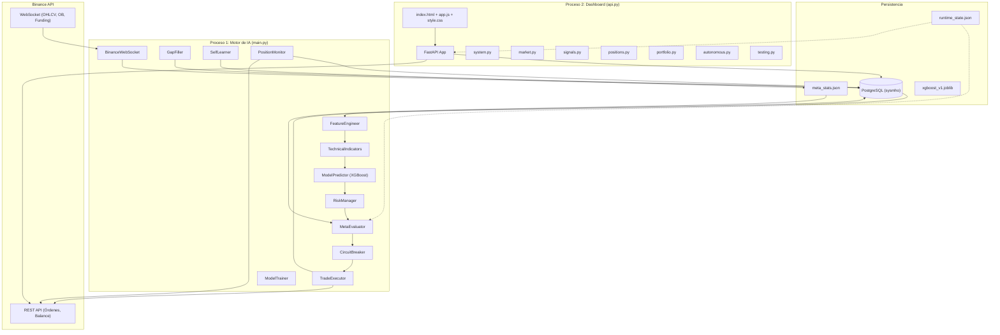
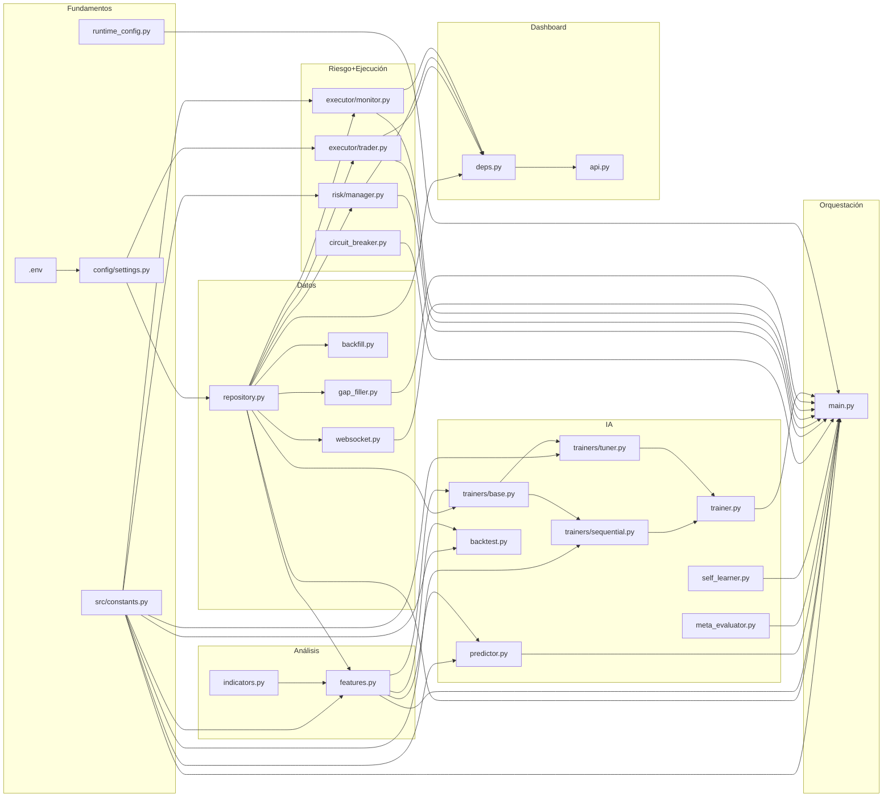

# 🧬 SysMho DNA — Mapa Genético del Proyecto

> Generado automáticamente por auditoría forense completa (68 archivos).
> Última auditoría: 31 de marzo de 2026 — **Actualizado 23:59 UTC-5**
> Versión del proyecto: **v15.2.0** | DB: PostgreSQL `sysmho` localhost:5432

---

## 1. Identidad del Proyecto

| Campo | Valor |
|-------|-------|
| **Nombre** | SysMho — Sistema Neuronal de Combate Financiero |
| **Versión** | 15.2.0 |
| **Propósito** | Bot de trading autónomo de criptomonedas en Binance Futures usando IA (XGBoost) |
| **Stack** | Python 3.12 + FastAPI + PostgreSQL + XGBoost + CCXT Pro |
| **Modo Actual** | Autónomo (configurable runtime) |
| **Exchange** | Binance Futures (Testnet/Mainnet configurable) |
| **Activos** | 10 pares: BTC, ETH, BNB, SOL, XRP, ADA, AVAX, LINK, DOT, POL (/USDT) |
| **Temporalidades** | 5m (primaria) + 1h, 4h (contexto macro) |
| **Features del Modelo** | 27 features (momentum, tendencia, precio, institucional, enjambre, macro) |

---

## 2. Arquitectura Global

### 2.1 Diagrama de Alto Nivel



### 2.2 Dos Procesos Independientes

| Proceso | Entry Point | Función |
|---------|------------|---------|
| **Motor de IA** | `python -m src.main` | Recolecta datos, predice, ejecuta trades, monitorea posiciones |
| **Dashboard** | `uvicorn src.dashboard.api:app` | API REST + Frontend visual para monitoreo y control |

**Comunicación entre procesos:**
- **PostgreSQL**: Ambos leen/escriben las mismas tablas (positions, trades, pending_approvals, portfolio)
- **runtime_state.json**: Canal de control (autonomía on/off, reset CB, sync status, último scan)
- **meta_stats.json**: SelfLearner escribe → MetaEvaluator lee (estadísticas de rendimiento)
- **sysmho_brain.log**: Motor escribe → Dashboard lee (telemetría en vivo)

---

## 3. Inventario Completo de Archivos

### 3.1 Configuración (6 archivos)

| Archivo | Propósito | Exports Clave | Depende de | Lo importan |
|---------|-----------|---------------|------------|-------------|
| `.env` | Variables de entorno (keys Binance, DB) | — | — | `config/settings.py` (via dotenv) |
| `.env.example` | Plantilla de `.env` | — | — | — |
| `config/__init__.py` | Package marker | — | — | — |
| `config/settings.py` | Carga y expone config centralizada | `BINANCE_API_KEY`, `BINANCE_SECRET_KEY`, `BINANCE_TESTNET`, `DATABASE_URL`, `DB_*` | `.env` | `repository.py`, `trader.py` |
| `src/constants.py` | Fuente única de verdad para constantes del sistema | `SYMBOLS`, `MODEL_FEATURES`, `DEFAULT_MODEL_PARAMS`, umbrales de riesgo/predicción, versión | — | Prácticamente **todos** los módulos |
| `src/runtime_config.py` | Canal compartido entre procesos via JSON | `is_autonomous()`, `set_autonomous()`, `reset_daily_pnl()`, `reset_circuit_breaker()`, `set_last_scan_at()`, `get_sync_status()` | — | `main.py`, `autonomous.py`, `system.py`, `portfolio.py`, `repository.py` |

### 3.2 Base de Datos (6 archivos)

| Archivo | Propósito | Exports Clave |
|---------|-----------|---------------|
| `src/database/schema.sql` | Esquema DDL completo (8 tablas + 3 índices) | Tablas: `market_data`, `sentiment_data`, `trades`, `positions`, `model_performance`, `risk_log`, `portfolio`, `pending_approvals` |
| `src/database/repository.py` | Repositorio async con asyncpg (pool 5-50) | `DatabaseRepository` (connect, insert_market_data_batch, upsert_market_data, sync_portfolio_on_trade, upsert_sentiment, upsert_liquidity_radar, get_sentiment, log_autonomous_decision, get_autonomous_decisions, get_daily_stats) |
| `src/database/__init__.py` | Re-exporta `DatabaseRepository` | |
| `migration_v14_9_0.sql` | Agrega `alert_category` y `score` a `pending_approvals` | |
| `migration_v15_0_0.sql` | Marca modelos v2 como deprecated, índice por model_name | |
| `migration_v15_2_0.sql` | Crea tablas `autonomous_decisions` y `meta_stats` | |

### 3.3 Recolección de Datos (4 archivos)

| Archivo | Propósito | Depende de |
|---------|-----------|------------|
| `src/collector/websocket.py` | Conexión en vivo CCXT Pro (OHLCV + Funding + OrderBook) — **SIEMPRE Binance REAL** (datos públicos) | `DatabaseRepository` |
| `src/collector/backfill.py` | Descarga masiva de historia OHLCV desde año arbitrario | `DatabaseRepository` |
| `src/collector/gap_filler.py` | Detección y relleno automático de vacíos al arrancar | `DatabaseRepository`, `runtime_config` |
| `src/collector/__init__.py` | Re-exporta `BinanceWebSocket` | |

### 3.4 Análisis Técnico (3 archivos)

| Archivo | Propósito | Exports Clave |
|---------|-----------|---------------|
| `src/analysis/indicators.py` | Calcula indicadores técnicos con librería `ta` | `TechnicalIndicators.add_all_indicators()` → RSI, MACD, Bollinger, EMA21/200, ATR, VWAP, ADX, StochRSI |
| `src/analysis/features.py` | Construye el dataset maestro de 27 features | `FeatureEngineer.get_master_dataframe()` → datos 5m + indicadores + macro 1h/4h + sentimiento + swarm |
| `src/analysis/__init__.py` | Re-exporta ambas clases | |

### 3.5 Inteligencia Artificial (10 archivos)

| Archivo | Propósito | Exports Clave |
|---------|-----------|---------------|
| `src/ai/predictor.py` | Motor de predicción (carga modelo, predice BUY/SELL/WAIT) | `ModelPredictor` → `predict_signal()`, `compute_score()`, `is_bounty()`, `get_feature_importance()` |
| `src/ai/trainer.py` | Orquestador de entrenamiento (proxy a Sequential + Tuner) | `ModelTrainer.train_model()` |
| `src/ai/trainers/base.py` | Base compartida: etiquetado y métricas | `BaseTrainer.create_labels()`, `save_performance()` |
| `src/ai/trainers/sequential.py` | Entrenamiento incremental multi-activo (xgb_model param) | `SequentialTrainer.train_model()` — TimeSeriesSplit 5-fold CV |
| `src/ai/trainers/tuner.py` | Optimización Bayesiana con Optuna | `BayesianTuner.tune_model()` — minimiza mlogloss |
| `src/ai/meta_evaluator.py` | Filtro estadístico de 2da capa para autonomía | `MetaEvaluator.evaluate()` → (meta_score, approved, reasons) |
| `src/ai/self_learner.py` | Aprendizaje continuo: actualiza stats por trade cerrado | `SelfLearner.update()`, `summary()` |
| `src/ai/backtest.py` | Simulación histórica con fees reales de Binance | `BacktestEngine.run_all()` → reporte con WR%, PF, Sharpe proxy |
| `src/ai/models/meta_stats.json` | Cache de estadísticas por símbolo/hora/dirección | Escrito por SelfLearner, leído por MetaEvaluator |
| `src/ai/models/xgboost_v1.joblib` | Modelo XGBoost serializado (tupla: model, features) | |

### 3.6 Gestión de Riesgo (2 archivos)

| Archivo | Propósito | Exports Clave |
|---------|-----------|---------------|
| `src/risk/manager.py` | Audita señales: Position Sizing, ATR SL/TP, Notional Cap 12%, Exposure Limit 50% | `RiskManager.evaluate_signal()` → dictamen aprobado/rechazado |
| `src/risk/__init__.py` | Re-exporta `RiskManager` | |

### 3.7 Ejecución (4 archivos)

| Archivo | Propósito | Exports Clave |
|---------|-----------|---------------|
| `src/executor/trader.py` | Puente a Binance: órdenes market, SL/TP, balance | `TradeExecutor` → `execute_trade()`, `check_api_link()`, `get_portfolio_balance()`, `get_active_positions_details()`, `close_position_on_exchange()` |
| `src/executor/monitor.py` | Vigilante 1s: PnL, TP/SL check, Escudo Capital 90%, sincronización Binance | `PositionMonitor.start_monitoring()`, `manual_close_position()` |
| `src/executor/circuit_breaker.py` | Protección dura: max posiciones, trades/día, pérdidas consecutivas, drawdown diario/semanal | `CircuitBreaker.check()` → (triggered, reason) |
| `src/executor/__init__.py` | Re-exporta `TradeExecutor`, `PositionMonitor` | |

### 3.8 Motor Principal (1 archivo)

| Archivo | Propósito |
|---------|-----------|
| `src/main.py` (840 líneas) | **Orquestador total**: `AutonomousBot` gestiona 8 loops paralelos + 30 WebSocket tasks (10 símbolos × 3 tf). Contiene: `_5min_scanner` (Top 3 REGULAR), `_bounty_watcher` (alta convicción), `_continuous_signal_scanner` (huérfanas), `_learning_loop` (SelfLearner), `_auto_train_loop` (reentrenamiento automático +1000 velas), `_accounting_sync_loop`, `_api_health_monitor_loop`, monitor de posiciones. También: `_evaluate_symbol()`, `_store_signal()`, `_autonomous_decide()`, `_handle_pending_approval()` |

### 3.9 Dashboard Backend (9 archivos)

| Archivo | Propósito | Endpoints Clave |
|---------|-----------|-----------------|
| `src/dashboard/api.py` | FastAPI app + middleware auth (X-API-Key) | `/` (index.html) |
| `src/dashboard/deps.py` | Instancias globales compartidas | `db`, `trader`, `risk`, `monitor`, `log_tactico()` |
| `routes/system.py` | Estado del sistema | `/api/system/status`, `/api/system/last_scan`, `/api/data/freshness`, `/api/db/status`, `/api/system/sync_status`, `/api/logs` |
| `routes/market.py` | Datos de mercado OHLCV | `/api/market_data/{symbol}` |
| `routes/signals.py` | Señales de IA (CRUD) | `/api/pending_signals`, `POST .../approve`, `POST .../reject`, `POST .../dismiss_all`, `/api/authorized_history` |
| `routes/positions.py` | Posiciones abiertas | `/api/positions`, `POST .../close` |
| `routes/portfolio.py` | Balance, stats, historial, ajuste capital | `/api/balance`, `/api/stats`, `/api/trades/history`, `POST .../adjust_capital`, `POST .../transfer_to_reserve`, `POST .../reset_pnl` |
| `routes/autonomous.py` | Control de autonomía | `/api/autonomous/status`, `/api/autonomous/decisions`, `POST .../toggle`, `POST .../reset_cb` |
| `routes/testing.py` | Inyección de señales de prueba | `POST /api/test/inject_signal` |

### 3.10 Dashboard Frontend (3 archivos)

| Archivo | Propósito | Tamaño |
|---------|-----------|--------|
| `src/dashboard/static/index.html` | Estructura HTML completa del dashboard + lockScreen | ~294 líneas |
| `src/dashboard/static/assets/style.css` | Estilos completos (glassmorphism, dark mode, animaciones) | ~772 líneas |
| `src/dashboard/static/assets/app.js` | Lógica frontend: auth, polling, gráficas, señales, autonomía | ~1230 líneas |

### 3.11 Tests (8 archivos)

| Archivo | Cobertura |
|---------|-----------|
| `tests/conftest.py` | Fixtures compartidas (DB mock, etc.) |
| `tests/test_phase1.py` | Fase 1: Conexión y recolección |
| `tests/test_phase2.py` | Fase 2: Indicadores técnicos |
| `tests/test_phase3.py` | Fase 3: Feature engineering |
| `tests/test_phase4.py` | Fase 4: Pipeline ML |
| `tests/test_phase5.py` | Fase 5: Gestión de riesgo |
| `tests/test_phase6.py` + `6b` | Fase 6: Ejecución y monitor |
| `tests/test_phase7.py` | Fase 7: Sistema de alertas |

### 3.12 Herramientas (4 archivos)

| Archivo | Propósito |
|---------|-----------|
| `tools/fix_portfolio.py` | Corrige desajustes contables entre portfolio e invested_usdt |
| `tools/test_connection.py` | Prueba de conectividad Binance Testnet |
| `tools/test_aggression.py` | Unit test del modo agresivo del predictor |
| `tools/verify_coherence.py` | Auditoría de coherencia entre Binance real y BD local |

---

## 4. Flujo de Datos Principal

```
Binance WebSocket (OHLCV en vivo, 3 tf × 10 símbolos)
    │
    ▼
BinanceWebSocket.watch_ohlcv() ──► DatabaseRepository.upsert_market_data()
    │                                      │
    │  (paralelo)                           ▼
    │  _keep_sentiment_alive() ──► upsert_sentiment() (funding_rate, OI)
    │  _monitor_order_book()   ──► upsert_liquidity_radar() (OBI)
    │
    ▼                                  PostgreSQL
GapFiller.fill_all_gaps()              (market_data, sentiment_data)
    │                                      │
    ▼                                      ▼
FeatureEngineer.get_master_dataframe()
    │
    ├── TechnicalIndicators.add_all_indicators() (RSI, MACD, BB, etc.)
    ├── _inject_macro_context() (merge_asof con 1h y 4h)
    ├── Normalización (atr_pct, ema_dist, macd_diff_pct, vwap_dist)
    ├── Inyección Institucional (funding_rate, obi_20)
    └── Swarm Intelligence (promedio RSI/MACD/bull de los otros 9 activos)
    │
    ▼
ModelPredictor.predict_signal()
    │
    ├── predict_proba(X) → [P(SELL), P(WAIT), P(BUY)]
    ├── Filtro de Inercia (WAIT > 72% → veto)
    ├── Ratio de Fuerza (dominante/opuesta ≥ 2.0)
    └── Alta Convicción (≥ 55% → PREMIUM)
    │
    ▼
RiskManager.evaluate_signal()
    │
    ├── Position Sizing Geométrico (ATR × multiplicador → SL/TP)
    ├── Notional Cap (max 12% del portafolio por trade)
    ├── Exposure Limit (max 50% total en posiciones)
    └── Escudo de Capital (SL min 10% del precio)
    │
    ▼
[MODO MANUAL]                    [MODO AUTÓNOMO]
    │                                │
    ▼                                ▼
Dashboard: Operador          CircuitBreaker.check()
aprueba/rechaza                     │
                                    ▼
                             MetaEvaluator.evaluate()
                                    │
                                    ├── Win rate global del símbolo
                                    ├── Win rate por hora+dirección
                                    ├── Calibración de confianza
                                    ├── Racha de pérdidas
                                    └── meta_score ≥ 0.52 → APROBADO
    │                                │
    ▼                                ▼
TradeExecutor.execute_trade()
    │
    ├── create_order(MARKET) → entrada
    ├── create_order(STOP_MARKET) → SL
    ├── create_order(TAKE_PROFIT_MARKET) → TP
    └── _log_trade() → trades + positions (BD)
    │
    ▼
PositionMonitor.start_monitoring() (cada 1 segundo)
    │
    ├── Actualiza PnL desde Binance (mark_price)
    ├── Verifica TP/SL
    ├── Escudo de Capital (≥90% pérdida → liquidación preventiva)
    ├── Sincronización Binance (posición cerrada externamente)
    └── _close_position() → trade CLOSED + sync_portfolio_on_trade()
    │
    ▼
SelfLearner.update(trade) → meta_stats.json
    │
    ▼
MetaEvaluator.reload_stats() (mejora continua)
```

---

## 5. Grafo de Dependencias



**Archivos Raíz** (no dependen de nada interno): `.env`, `constants.py`, `circuit_breaker.py`
**Archivos Hub** (más dependencias): `main.py` (importa 15+ módulos), `repository.py`, `features.py`
**Archivos Hoja** (nadie los importa directamente): `backtest.py`, `backfill.py`, tools/*, tests/*

---

## 6. Módulos por Capa

### 6.1 Configuración
- `.env`: 6 variables (Binance keys, DB connection)
- `config/settings.py`: Carga con `dotenv`, valida que las keys existan, construye `DATABASE_URL`
- `src/constants.py`: 167 líneas. Define los 10 símbolos, 27 features del modelo, hiperparámetros XGBoost (Optuna-optimizados), umbrales de predicción, parámetros de riesgo (2% risk/trade, ATR×1.5 SL, ATR×3.0 TP, 12% Notional Cap), intervalos de polling
- `runtime_config.py`: Lee/escribe `runtime_state.json` como canal IPC. Funciones: `is_autonomous()`, `set_autonomous()`, `reset_daily_pnl()`, `reset_circuit_breaker()`, `set_sync_status()`, `set_last_scan_at()`
- `runtime_state.json`: Estado actual: `autonomous_mode`, `sync_status`, `last_scan_at`, `pnl_reset_at`, `cb_reset_at`

### 6.2 Base de Datos
- **8 tablas**: `market_data` (OHLCV + ATR14), `sentiment_data` (funding + OBI), `trades` (historial completo), `positions` (abiertas), `model_performance`, `risk_log`, `portfolio` (contabilidad triple), `pending_approvals` (señales)
- **2 tablas v15.2**: `autonomous_decisions`, `meta_stats`
- `repository.py`: Pool asyncpg 5-50 conexiones. Calcula ATR14 en batch al insertar. Métodos clave: `upsert_market_data` (vela viva + recálculo ATR), `sync_portfolio_on_trade` (contabilidad atómica OPEN/CLOSE), `get_daily_stats` (respeta reset CB)

### 6.3 Recolección de Datos
- **WebSocket**: CCXT Pro, siempre Binance REAL (datos públicos). Tres tasks por símbolo: OHLCV, Funding Rate (60s), Order Book L2 (5s)
- **Backfill**: Descarga masiva desde año arbitrario. CLI: `--symbol`, `--timeframe`, `--year`
- **GapFiller**: Al arrancar detecta vacíos por símbolo×tf y los rellena automáticamente. Actualiza `sync_status` en runtime_state.json

### 6.4 Análisis Técnico
- `indicators.py`: 10 indicadores calculados con librería `ta`: RSI14, MACD+histograma, Bollinger %B, EMA21, EMA200, ATR14, VWAP14, ADX+DI+, StochRSI-K
- `features.py`: Pipeline completo de 27 features:
  - **5m base** (12): rsi_14, stoch_rsi_k, macd_diff_pct, adx, adx_pos, bb_pband, atr_pct, ema_21_dist, ema_200_dist, vwap_dist, pct_change, vol_change
  - **Institucional** (2): funding_rate, obi_20
  - **Enjambre** (3): swarm_rsi_avg, swarm_macd_avg, swarm_bull_ratio (promedios de los otros 9 activos, con lag de 1 período para evitar look-ahead)
  - **Macro 1h** (5): h1_rsi_14, h1_macd_diff_pct, h1_adx, h1_bb_pband, h1_atr_pct
  - **Macro 4h** (5): h4_rsi_14, h4_macd_diff_pct, h4_adx, h4_bb_pband, h4_atr_pct

### 6.5 Inteligencia Artificial
- **Predictor**: 3 clases (SELL=0, WAIT=1, BUY=2). Filtros: Inercia (WAIT>72% → veto), Confianza mínima (38%), Ratio de fuerza (≥2.0), Alta convicción (≥55% → PREMIUM). Score compuesto: conf×40% + strength×30% + alignment×20% + RR×10%
- **Trainer**: Orquesta Sequential + Bayesian (Optuna). Incremental: carga modelo previo → `xgb_model=booster` en fit
- **Sequential**: TimeSeriesSplit 5-fold CV. Pesos balanceados (`compute_sample_weight`). Guarda como `(model, features)` en joblib. Limpia RAM agresivamente entre activos
- **Tuner**: Optuna minimizando mlogloss. Rango: n_estimators 50-300, max_depth 3-10, lr 0.01-0.2 (log), subsample 0.5-1.0
- **MetaEvaluator**: 5 componentes (win rate global, win rate hora+dirección, calibración confianza, racha pérdidas, confianza base). Promedio → meta_score. Umbral: ≥0.52
- **SelfLearner**: Actualiza `meta_stats.json` por trade cerrado: win_rate global, por hora+dirección, calibración de confianza por buckets de 0.05. Flag para meta-modelo cuando ≥200 trades
- **Backtest**: Simulación vectorizada con numpy. Fees reales (taker 0.04%, maker 0.02%, funding estimado). Forward-simulation max 288 velas (24h). Reporte: WR%, Profit Factor, PnL bruto/neto

### 6.6 Gestión de Riesgo
- **Position Sizing Geométrico**: `max_usd_loss / sl_distance = position_size_crypto`
- **ATR-based SL/TP**: Normal SL=ATR×1.5, TP=ATR×3.0 (R:R 1:2). Agresivo SL=ATR×1.0, TP=ATR×2.5
- **Capital Shield**: SL nunca < 10% del precio (evita flash crashes)
- **Notional Cap**: Max 12% del portafolio por trade
- **Exposure Limit**: Rechaza si total en posiciones > 50% del capital
- **Min Notional**: 6 USDT (Binance exige 5)

### 6.7 Ejecución
- **TradeExecutor**: CCXT async. Testnet/Mainnet configurable. Health monitor con estados: ACTIVE, RECONNECTING, INVALID_KEYS, DISCONNECTED. Orden: Market entry → STOP_MARKET (SL) → TAKE_PROFIT_MARKET (TP) → registro atómico en BD
- **PositionMonitor**: Loop de 1 segundo. 3 fuentes de precio: Binance (preferida), BD (fallback), ninguno (skip). Cierre por: TP, SL, Escudo Capital (90% pérdida), BINANCE_SYNC (cerrada externamente), MANUAL_USER. Fee de cierre descontada del PnL neto
- **CircuitBreaker**: 5 checks: drawdown diario ≥4%, semanal ≥8%, ≥3 pérdidas consecutivas, ≥3 posiciones abiertas, ≥8 trades/día. Configurable via .env

### 6.8 Motor Principal (main.py)
**8 loops paralelos:**
1. `_5min_scanner`: Evalúa 10 activos → Top 3 señales REGULAR
2. `_bounty_watcher`: Cada 30s busca señales BOUNTY (≥55% conf, 3 TF alineados, R/R≥3)
3. `_continuous_signal_scanner`: Cada 5s detecta señales huérfanas
4. `_learning_loop`: Cada 60s procesa trades cerrados → SelfLearner
5. `_auto_train_loop`: Cada 1h verifica si hay +1000 velas nuevas → reentrenamiento
6. `_accounting_sync_loop`: Cada 5min audita contabilidad portfolio vs positions
7. `_api_health_monitor_loop`: Cada 30s ping a Binance REST
8. `monitor.start_monitoring()`: Vigilancia continua de posiciones

**+30 WebSocket tasks:** 10 símbolos × 3 timeframes (5m, 1h, 4h)

### 6.9 Dashboard Backend
- `api.py`: FastAPI con middleware `api_key_middleware` que protege `/api/*` con header `X-API-Key` (comparado con env `DASHBOARD_API_KEY`)
- `deps.py`: Singleton pattern para `db`, `trader`, `risk`, `monitor`. Evita imports circulares
- 7 routers montados en el app

### 6.10 Dashboard Frontend
- **index.html**: LockScreen overlay (z-index 9999), estructura del dashboard con cards para balance, PnL, posiciones, señales, telemetría, autonomía
- **style.css**: Dark glassmorphism, gradientes, animaciones, terminal monocromática
- **app.js** (~1230 líneas): 
  - `initAuth()`: Valida API Key al cargar (con reintento si servidor offline)
  - `unlockDashboard()`: Login con feedback de error
  - `startLifecycles()`: 14 intervalos de polling (2s-10s)
  - `apiFetch()`: Wrapper que inyecta header X-API-Key en todas las peticiones
  - Funciones de renderizado para cada sección del dashboard
  - Panel de autonomía con toggle, Circuit Breaker reset, decisiones

---

## 7. Patrones y Convenciones

### 7.1 Patrones de Diseño
- **Repository Pattern**: `DatabaseRepository` como única puerta a PostgreSQL
- **Singleton**: `deps.py` instancia globales compartidas
- **Strategy**: Modos Normal/Agresivo en predictor y risk manager
- **Observer**: Monitor vigila posiciones en loop continuo
- **Pipeline**: Datos → Indicadores → Features → Predicción → Riesgo → Ejecución
- **IPC via File**: `runtime_state.json` como canal de comunicación entre procesos

### 7.2 Convenciones de Nombre
- Clases: PascalCase (`ModelPredictor`, `TradeExecutor`)
- Funciones: snake_case (`predict_signal`, `evaluate_signal`)
- Constantes: UPPER_SNAKE (`SYMBOLS`, `MODEL_FEATURES`, `NORMAL_MIN_CONFIDENCE`)
- Prefijos privados: `_` para métodos internos
- Emojis en logs: 🚀 inicio, ✅ éxito, ❌ error, ⚠️ warning, 📡 conexión, 🛡️ seguridad

### 7.3 Manejo de Errores
- Try/catch silencioso en loops para no romper el sistema completo
- Monitor distingue `None` (API falló) vs `{}` (sin posiciones) vs `{sym}` (posición activa)
- Trader maneja ReduceOnly rejection (-2022) como "posición ya cerrada"
- Backoff exponencial implícito (sleep 5s en errores, sleep 3s en red)

### 7.4 Logging
- `sysmho_brain.log`: Archivo compartido entre procesos. El motor escribe con `sysmho_print()` (override global de `print`). Dashboard lee con `/api/logs`
- Prefijos: `[TRADER]`, `[MONITOR]`, `[MANDO]`, `[AUTONOMÍA]`, `[GAP FILLER]`, `[SCANNER 5M]`

---

## 8. Puntos de Configuración Críticos

### Variables de Entorno (.env)
| Variable | Función |
|----------|---------|
| `BINANCE_API_KEY` / `BINANCE_SECRET_KEY` | Credenciales Binance |
| `BINANCE_TESTNET` | `True` = Testnet, `False` = Mainnet |
| `DB_HOST/PORT/USER/PASSWORD/NAME` | PostgreSQL |
| `DASHBOARD_API_KEY` | Clave de acceso al dashboard |
| `AUTONOMOUS_MODE` | Fallback si runtime_state.json no existe |
| `META_SCORE_THRESHOLD` | Umbral MetaEvaluator (default 0.52) |
| `META_MIN_TRADES` | Trades mínimos para estadísticas (default 10) |
| `CB_MAX_POSITIONS` | Max posiciones simultáneas (default 3) |
| `CB_MAX_DAILY_TRADES` | Max trades por día (default 8) |
| `CB_MAX_CONSEC_LOSSES` | Max pérdidas consecutivas (default 3) |
| `CB_DAILY_LOSS_PCT` | Drawdown diario límite (default 0.04 = 4%) |
| `CB_WEEKLY_DRAWDOWN_PCT` | Drawdown semanal límite (default 0.08 = 8%) |

### Constantes del Motor (constants.py)
- `LABEL_THRESHOLD = 0.007` (0.7% para etiquetado BUY/SELL)
- `NORMAL_MIN_CONFIDENCE = 0.38` (38% mínimo)
- `NORMAL_INERTIA_THRESHOLD = 0.72` (veto si WAIT > 72%)
- `HIGH_CONVICTION_THRESHOLD = 0.55` (BOUNTY)
- `SIGNAL_SCAN_INTERVAL_SECONDS = 300` (5 min)

---

## 9. Puntos de Extensión

| Qué modificar | Dónde |
|---------------|-------|
| Agregar nuevos activos | `src/constants.py` → `SYMBOLS` (y hacer backfill) |
| Agregar features al modelo | `src/constants.py` → `MODEL_FEATURES` + `src/analysis/features.py` (cálculo) + reentrenar |
| Agregar endpoints API | `src/dashboard/routes/` (nuevo router) + registrar en `routes/__init__.py` + `api.py` |
| Modificar lógica de riesgo | `src/risk/manager.py` + constantes en `constants.py` |
| Cambiar hiperparámetros | `src/constants.py` → `DEFAULT_MODEL_PARAMS` o ejecutar con `--tune` |
| Agregar notificaciones | Crear `src/notifications/` + hooks en `main.py` |
| Ajustar Circuit Breaker | Variables de entorno `CB_*` (sin reiniciar código) |

---

## 10. Auditoría de Base de Datos (En Vivo)

> Auditada el 31 de marzo de 2026 contra PostgreSQL `sysmho` en `localhost:5432`

### 10.1 Tablas y Volumen

| Tabla | Filas (exactas) | Rol en el Sistema |
|-------|-----------------|-------------------|
| `market_data` | **6,778,641** | Velas OHLCV + ATR14 (dato primario del sistema) |
| `risk_log` | 5,468 | Log de auditoría de cada señal evaluada |
| `pending_approvals` | 506 | Señales de IA pendientes/resueltas |
| `trades` | 151 | Historial de operaciones (EXECUTED + CLOSED) |
| `model_performance` | 100 | Métricas de entrenamiento del modelo IA |
| `autonomous_decisions` | 80 | Log de decisiones del MetaEvaluador |
| `sentiment_data` | 10 | Funding rate + OBI por símbolo |
| `portfolio` | 2 | Estado contable del capital |
| `positions` | **0** | Sin posiciones abiertas actualmente |
| `meta_stats` | 0 | (No utilizada — SelfLearner usa JSON en disco) |

**Total de datos**: ~6.8 millones de registros. La tabla `market_data` contiene **~5.3 años** de historia (desde dic 2019).

### 10.2 Esquema Detallado (113 columnas en 10 tablas)

<details>
<summary>Click para ver columnas completas por tabla</summary>

#### `autonomous_decisions` (10 cols)
| Columna | Tipo | Nullable | Default |
|---------|------|----------|---------|
| id | bigint | NO | autoincrement |
| pending_id | integer | YES | — |
| symbol | varchar | NO | — |
| decision | varchar | NO | — |
| meta_score | numeric | YES | — |
| confidence | numeric | YES | — |
| direction | varchar | YES | — |
| reasons | text[] | YES | — |
| cb_active | boolean | YES | false |
| created_at | timestamptz | YES | now() |

#### `market_data` (9 cols)
| Columna | Tipo | Nullable | Default |
|---------|------|----------|---------|
| id | bigint | NO | autoincrement |
| symbol | varchar | NO | — |
| timeframe | varchar | NO | — |
| open_time | timestamptz | NO | — |
| open, high, low, close | numeric | NO | — |
| volume | numeric | NO | — |
| atr_14 | numeric | YES | — |

#### `trades` (14 cols)
| Columna | Tipo | Nullable | Default |
|---------|------|----------|---------|
| id | bigint | NO | autoincrement |
| symbol, side, order_type | varchar | NO | — |
| quantity, price, total | numeric | NO | — |
| fee | numeric | YES | 0 |
| pnl | numeric | YES | — |
| signal_source | varchar | YES | — |
| status | varchar | YES | 'EXECUTED' |
| executed_at | timestamptz | YES | now() |
| invested_usdt | numeric | YES | 0 |
| leverage | numeric | YES | 1.0 |
| order_id | varchar | YES | — |

#### `positions` (12 cols)
| Columna | Tipo | Nullable | Default |
|---------|------|----------|---------|
| id | bigint | NO | autoincrement |
| symbol | varchar | NO | UNIQUE |
| side | varchar | NO | — |
| entry_price, quantity | numeric | NO | — |
| current_price, stop_loss, take_profit | numeric | YES | — |
| pnl_unrealized | numeric | YES | — |
| opened_at, updated_at | timestamptz | YES | now() |
| invested_usdt | numeric | YES | — |
| leverage | numeric | YES | 1.0 |

#### `pending_approvals` (19 cols)
Incluye: symbol, side, quantity, entry_price, stop_loss, take_profit, risk_score, status ('PENDING'), invested_usdt, win/loss_probability, potential_profit/loss_usdt, exposure_warning, signal_type, trend_5m/1h/4h, alert_category ('REGULAR'), score

#### `portfolio` (6 cols)
total_balance, available_balance, in_positions, total_pnl, win_rate, recorded_at

#### `sentiment_data` (5 cols)
symbol (UNIQUE), funding_rate, open_interest, obi_20, updated_at

#### `risk_log` (6 cols)
signal_type, symbol, reason, approved (bool), risk_score, created_at

#### `model_performance` (7 cols)
model_name, accuracy, precision_score, recall, total_predictions, correct_predictions, trained_at

#### `meta_stats` (7 cols)
symbol, hour_utc, direction | UNIQUE(symbol, hour_utc, direction), total_trades, winning_trades, win_rate, avg_pnl_pct, updated_at

</details>

### 10.3 Índices (22 detectados)

| Tabla | Índice | Escaneos (uso) |
|-------|--------|----------------|
| `market_data` | `market_data_symbol_timeframe_open_time_key` (UNIQUE) | **16.2M** ← MÁS USADO |
| `market_data` | `market_data_pkey` | 6.8M |
| `market_data` | `idx_market_data_symbol_tf` | 1.8M |
| `pending_approvals` | `pending_approvals_pkey` | 372K |
| `pending_approvals` | `idx_pending_status` | 12K |
| `sentiment_data` | `sentiment_data_symbol_key` (UNIQUE) | 89K |
| `autonomous_decisions` | `idx_adec_created` | 53 |
| `trades` | `trades_pkey` | 359 |
| `positions` | `positions_symbol_key` (UNIQUE) | 148 |
| `positions` | `positions_pkey` | 109 |

> Los índices de `market_data` son los más críticos — manejan millones de escaneos. Los demás son de bajo tráfico.

### 10.4 Datos de Mercado por Activo

| Símbolo | 5m Velas | 1h Velas | 4h Velas | Desde | Última 5m | Última 4h | Frescura 5m |
|---------|----------|----------|----------|-------|-----------|-----------|-------------|
| BTC/USDT | 652,806 | 54,432 | 13,627 | 2019-12-31 | 18:45 hoy | 15:00 hoy | ✅ ~29 min |
| ETH/USDT | 652,805 | 54,432 | 13,627 | 2019-12-31 | 18:45 hoy | 15:00 hoy | ✅ ~29 min |
| BNB/USDT | 652,806 | 54,432 | 13,627 | 2019-12-31 | 18:45 hoy | 15:00 hoy | ✅ ~29 min |
| XRP/USDT | 652,806 | 54,432 | 13,627 | 2019-12-31 | 18:45 hoy | 15:00 hoy | ✅ ~29 min |
| ADA/USDT | 652,806 | 54,432 | 13,627 | 2019-12-31 | 18:45 hoy | 15:00 hoy | ✅ ~29 min |
| LINK/USDT | 652,805 | 54,432 | 13,627 | 2019-12-31 | 18:45 hoy | 15:00 hoy | ✅ ~29 min |
| SOL/USDT | 588,687 | 49,086 | 12,289 | 2020-08-11 | 18:45 hoy | 15:00 hoy | ✅ ~29 min |
| DOT/USDT | 586,467 | 48,901 | 12,243 | 2020-08-18 | 18:45 hoy | 15:00 hoy | ✅ ~29 min |
| AVAX/USDT | 576,584 | 48,078 | 12,037 | 2020-09-22 | 18:45 hoy | 15:00 hoy | ✅ ~29 min |
| POL/USDT | 493,615 | 41,162 | 10,307 | 2019-12-31 | 18:45 hoy | 15:00 hoy | ✅ ~29 min |

> **Motor detenido** (5m última vela hace ~29 min). Datos 4h con ~254 min = DELAYED según umbral del dashboard (STALE > 900s = 15min → 4h siempre será DELAYED entre cierres). Datos históricos cubren 5+ años para la mayoría.

### 10.5 Estado Contable

| Métrica | Valor |
|---------|-------|
| **Portfolio total_balance** | **-$40.49** |
| **Portfolio available_balance** | -$604.04 |
| **Portfolio in_positions** | $563.55 |
| **SUM(positions.invested_usdt)** | **$0.00** (0 posiciones) |
| **Posiciones abiertas** | **0** |
| **PnL flotante** | $0.00 |

> 🚨 **DESAJUSTE CONTABLE CRÍTICO**: `portfolio.in_positions` = $563.55 pero la tabla `positions` está **vacía** (0 filas). El sistema cree que hay $563.55 de margen bloqueado pero no hay ninguna posición. Esto indica que una posición fue cerrada en Binance pero la BD no se sincronizó correctamente (`_close_position` no se disparó). Usar `tools/fix_portfolio.py` para corregir.
>
> ⚠️ `total_balance` es **negativo** (-$40.49). El capital real es deficitario. Requiere `adjust_capital` vía dashboard para inyectar el balance correcto de Binance.

### 10.6 Estadísticas de Trading

| Métrica | Valor |
|---------|-------|
| **Trades cerrados** | 68 |
| **Ganadores** | 32 (47.1%) |
| **Perdedores** | 34 (50.0%) |
| **Breakeven** | 2 |
| **PnL total neto** | **-$49.04** |
| **PnL promedio por trade** | -$0.72 |
| **Primer trade** | 2026-03-17 |
| **Último trade** | 2026-03-31 18:45 |

> ⚠️ El sistema está **perdiendo dinero** (-$49.04 en 14 días, empeorando). El win rate bajó a 47.1% — ahora hay más perdedores (34) que ganadores (32). El sistema necesita la evolución propuesta en `EVOLUTION_AI_PROPOSAL.md`.

### 10.7 Señales y Decisiones

**Señales (pending_approvals):**
| Status | Count |
|--------|-------|
| DISMISSED | 334 (66%) |
| REJECTED | 96 (19%) |
| EXECUTED | 76 (15%) |

**Decisiones Autónomas:**
| Decisión | Count | MetaScore Promedio |
|----------|-------|-------------------|
| APPROVED | 42 (52.5%) | **0.6748** |
| REJECTED | 38 (47.5%) | 0.1294 |

> El MetaEvaluador rechaza casi la mitad de las señales. El meta_score promedio de los rechazos (0.13) está muy por debajo del umbral (0.52), indicando que el filtro funciona correctamente.

### 10.8 Rendimiento del Modelo IA

| Modelo | Accuracy | Precision | Recall | Predicciones | Entrenado |
|--------|----------|-----------|--------|-------------|-----------|
| serial_BTC_USDT_v3 | **97.2%** | 99.7% | 97.2% | 96,433 | 2026-03-27 |
| serial_BNB_USDT_v3 | **95.2%** | 99.5% | 95.2% | 96,432 | 2026-03-27 |
| serial_SOL_USDT_v3 | **91.3%** | 98.2% | 91.3% | 86,798 | 2026-03-27 |
| serial_POL_USDT_v3 | **90.4%** | 97.9% | 90.4% | 72,479 | 2026-03-27 |
| serial_ETH_USDT_v3 | **88.9%** | 98.7% | 88.9% | 96,433 | 2026-03-27 |
| serial_XRP_USDT_v3 | **88.5%** | 98.5% | 88.5% | 96,433 | 2026-03-27 |
| serial_AVAX_USDT_v3 | **88.2%** | 97.7% | 88.2% | 84,944 | 2026-03-27 |
| serial_DOT_USDT_v3 | **84.4%** | 97.6% | 84.4% | 86,479 | 2026-03-27 |
| serial_LINK_USDT_v3 | **83.5%** | 97.5% | 83.5% | 96,433 | 2026-03-27 |
| serial_ADA_USDT_v3 | **83.4%** | 97.7% | 83.4% | 96,432 | 2026-03-27 |

> ⚠️ **PARADOJA CRÍTICA**: El modelo reporta accuracy del 83-97% pero el win rate real es 48.5%. Esto ocurre porque la clase WAIT domina (~85% de los datos). El modelo aprende a predecir WAIT correctamente y eso infla el accuracy global, pero **cuando dice BUY o SELL, acierta menos de la mitad de las veces**. Este es un problema clásico de **class imbalance** que los `compute_sample_weight` no resuelven completamente.

### 10.9 Coherencia Esquema vs Código

| Verificación | Estado | Detalle |
|-------------|--------|---------|
| Tablas de schema.sql existen | ✅ | Las 8 tablas originales + 2 de v15.2 están presentes |
| Columnas coinciden con queries | ✅ | 113 columnas verificadas contra repository.py y routes |
| Índices creados | ✅ | 22 índices activos, incluyendo los de migraciones |
| Contabilidad cuadra | ⚠️ | `in_positions` coincide pero `total_balance` es negativo |
| Datos frescos | ✅ | Todos los activos con datos de hace < 1 hora |
| Tabla `meta_stats` usada | ❌ | 0 filas — `SelfLearner` usa `meta_stats.json` en disco, no la tabla BD |
| `trained_at` vs `created_at` | ⚠️ | La columna en `model_performance` se llama `trained_at` en la BD pero `created_at` en el schema.sql — posible rename en migración |

---

## 11. Estado Actual y Limitaciones

### Datos Operativos (BD en vivo — auditada 2026-03-31 ~19:15 UTC-5)
- **6.778M velas** en `market_data` (~5.3 años de historia, 30 combinaciones símbolo×TF)
- **68 trades cerrados** en 14 días (WR 47.1%, PnL **-$49.04**)
- **0 posiciones abiertas** (pero `portfolio.in_positions` = $563.55 — desajuste crítico)
- **Modelo entrenado** el 2026-03-27 con 83-97% accuracy (inflado por class imbalance)
- **MetaEvaluador**: 42 aprobaciones (score 0.67), 38 rechazos (score 0.13)

### Limitaciones Conocidas
1. **Sin precio de liquidación**: El dashboard muestra `invested_usdt` (notional) pero no el margen real ni precio de liquidación
2. **Sin notificaciones externas**: Todo el monitoreo depende del dashboard visual
3. **Modelo único**: Solo XGBoost v3. Sin ensemble ni meta-modelo automático
4. **Reentrenamiento manual**: `_auto_train_loop` solo reentrena tras +1000 velas nuevas por activo, no detecta drift
5. **Sin backtesting integrado en dashboard**: `backtest.py` es CLI-only
6. **Funding Rate no descontado en PnL**: Solo se estima en backtest, no se trackea en vivo
7. **avg_pnl_pct en meta_stats = 0.0**: Los trades cerrados no tienen `exit_price` separado del `entry_price` en la tabla trades (campo único `price`)
8. **Tabla `meta_stats` sin uso**: SelfLearner persiste en JSON pero la tabla BD v15.2 está vacía
9. **Balance negativo**: El portfolio muestra -$37.91, requiere `adjust_capital` o reset

### Deuda Técnica
- `main.py` tiene 840 líneas — podría descomponerse en submódulos
- El interceptor global de `print` puede causar sorpresas en imports de terceros
- Los tests no cubren autonomía (no hay test_phase8)
- `exposure_warning` se calcula pero actualmente rechaza el trade en lugar de solo advertir
- Accuracy del modelo es engañosa por class imbalance — necesita métricas per-clase (solo BUY/SELL)

### Paradoja Accuracy vs Win Rate
El modelo reporta 83-97% accuracy pero gana solo 48.5% de los trades reales. Esto se explica porque:
- La clase WAIT domina el dataset (~85% de las etiquetas)
- El accuracy global premia predecir WAIT correctamente
- Lo que importa para trading es la **precision de BUY y SELL**, no el accuracy global
- Los `classification_report` per-clase se imprimen en consola durante el training pero NO se persisten en BD

---

*Documento generado por la skill `sysmho-dna` v2 (con auditoría de BD). Para regenerar, ejecutar la skill nuevamente.*

---

## 12. Relación y Tabla de Verdad — Mapa Completo del Sistema

> Cada fila = un archivo fuente. Columnas: qué importa, quién lo importa, tablas BD que toca (R=lee, W=escribe), archivos de estado que toca, variables de entorno que usa, efectos secundarios observables.

### 12.1 Capa de Configuración

| Archivo | Importa de (interno) | Lo importa | Tablas BD | Estado / Archivos | Env Vars | Efectos |
|---------|---------------------|-----------|-----------|------------------|----------|---------|
| `.env` | — | `config/settings.py` (dotenv) | — | — | **TODAS** | Fuente de secrets |
| `config/settings.py` | `.env` | `repository.py`, `trader.py`, `conftest.py`, tools | — | — | `BINANCE_*`, `DB_*`, `DASHBOARD_API_KEY`, `AUTONOMOUS_MODE`, `META_*`, `CB_*` | Lanza `ValueError` si faltan keys |
| `src/constants.py` | — | **todos los módulos** | — | — | — | Fuente única de verdad numérica |
| `src/runtime_config.py` | — | `main.py`, `autonomous.py`, `system.py`, `portfolio.py`, `gap_filler.py`, `repository.py` | — | `runtime_state.json` (R+W atómico) | — | Canal IPC entre procesos; escribe con `.tmp` → `os.replace` |

### 12.2 Capa de Base de Datos

| Archivo | Importa de (interno) | Lo importa | Tablas BD (R/W) | Efectos |
|---------|---------------------|-----------|-----------------|---------|
| `src/database/schema.sql` | — | *(DDL manual)* | Crea todas | Define estructura; no es código Python |
| `migration_v14_9_0.sql` | — | *(DDL manual)* | `pending_approvals` (ALTER) | Agrega `alert_category`, `score`, 3 índices |
| `migration_v15_0_0.sql` | — | *(DDL manual)* | `model_performance` (ALTER) | Marca v2 deprecated, índice `model_name` |
| `migration_v15_2_0.sql` | — | *(DDL manual)* | Crea `autonomous_decisions`, `meta_stats` | Añade tablas de autonomía y estadísticas |
| `src/database/repository.py` | `config/settings.py`, `src/constants.py`, `src/runtime_config.py` | `main.py`, `deps.py`, `gap_filler.py`, `websocket.py`, `backfill.py`, `features.py`, `risk/manager.py`, `trader.py`, `monitor.py`, `base.py`, `backtest.py`, tools | `market_data`(R+W), `sentiment_data`(R+W), `trades`(R+W), `positions`(R+W), `portfolio`(R+W), `pending_approvals`(R+W), `risk_log`(W), `model_performance`(W), `autonomous_decisions`(W), `meta_stats`(R) | Pool asyncpg 5-50; calcula ATR14 al insertar |

### 12.3 Capa de Recolección de Datos

| Archivo | Importa de (interno) | Lo importa | Tablas BD (R/W) | Estado | Efectos |
|---------|---------------------|-----------|-----------------|--------|---------|
| `src/collector/websocket.py` | `repository.py` | `main.py` | `market_data`(W), `sentiment_data`(W) | — | 30 streams WS (10×3TF) + funding cada 60s + OB L2 cada 5s. SIEMPRE Binance REAL |
| `src/collector/backfill.py` | `repository.py` | *(CLI directo)* | `market_data`(W) | — | Descarga masiva histórica via CCXT. Puede tardar horas |
| `src/collector/gap_filler.py` | `repository.py`, `runtime_config.py` | `main.py` | `market_data`(R+W) | `runtime_state.json` (W: `sync_status`) | Rellena vacíos al arrancar; actualiza badge de sync en dashboard |

### 12.4 Capa de Análisis Técnico

| Archivo | Importa de (interno) | Lo importa | Tablas BD (R/W) | Efectos |
|---------|---------------------|-----------|-----------------|---------|
| `src/analysis/indicators.py` | — | `features.py` | — | Calcula 10 indicadores sobre DataFrame; no toca BD |
| `src/analysis/features.py` | `repository.py`, `indicators.py`, `constants.py` | `main.py`, `trainers/base.py`, `backtest.py` | `market_data`(R), `sentiment_data`(R) | Construye el DataFrame de 27 features; query con f-string (LIMIT = int interno, no inyectable) |

### 12.5 Capa de Inteligencia Artificial

| Archivo | Importa de (interno) | Lo importa | Tablas BD (R/W) | Archivos (R/W) | Env Vars | Efectos |
|---------|---------------------|-----------|-----------------|---------------|----------|---------|
| `src/ai/predictor.py` | `constants.py` | `main.py`, `tools/test_aggression.py` | — | `xgboost_v1.joblib`(R), `best_params.joblib`(R opt.) | — | Carga modelo al instanciar; falla silenciosamente si no existe |
| `src/ai/trainer.py` | `trainers/sequential.py`, `trainers/tuner.py` | `main.py` | — | `xgboost_v1.joblib`(W) | — | CLI con `--symbol`, `--tune`, `--trials` |
| `src/ai/trainers/base.py` | `repository.py`, `features.py`, `constants.py` | `sequential.py`, `tuner.py` | `model_performance`(W), `market_data`(R) | — | `LABEL_THRESHOLD=0.007` fijo |
| `src/ai/trainers/sequential.py` | `trainers/base.py`, `constants.py` | `trainer.py` | `model_performance`(W) | `xgboost_v1.joblib`(R+W) | — | `run_in_executor` para no bloquear event loop |
| `src/ai/trainers/tuner.py` | `trainers/base.py`, `constants.py` | `trainer.py` | — | `best_params.joblib`(W) | — | Optuna Bayesiano; `run_in_executor` para Optuna |
| `src/ai/meta_evaluator.py` | `constants.py` | `main.py` | — | `meta_stats.json`(R) | `META_SCORE_THRESHOLD`, `META_MIN_TRADES` | `reload_stats()` antes de cada evaluación; usa JSON en disco, no la tabla BD |
| `src/ai/self_learner.py` | — | `main.py` | — | `meta_stats.json`(R+W atómico) | — | Actualiza stats por trade cerrado; escribe con `.tmp` → `os.replace` |
| `src/ai/backtest.py` | `features.py`, `constants.py`, `repository.py` | *(CLI directo)* | `market_data`(R) | — | — | Simulación vectorizada numpy; no modifica BD ni estado |

### 12.6 Capa de Gestión de Riesgo

| Archivo | Importa de (interno) | Lo importa | Tablas BD (R/W) | Env Vars | Efectos |
|---------|---------------------|-----------|-----------------|----------|---------|
| `src/risk/manager.py` | `repository.py`, `constants.py` | `main.py`, `deps.py` | `portfolio`(R), `positions`(R), `risk_log`(W) | — | Logs cada decisión en `risk_log`; consulta portafolio para Exposure Limit |

### 12.7 Capa de Ejecución

| Archivo | Importa de (interno) | Lo importa | Tablas BD (R/W) | Archivos (W) | Env Vars | Efectos |
|---------|---------------------|-----------|-----------------|-------------|----------|---------|
| `src/executor/trader.py` | `config/settings.py`, `constants.py`, `repository.py` | `main.py`, `deps.py` | `trades`(W), `positions`(W), `portfolio`(W) | `sysmho_brain.log`(W) | `BINANCE_API_KEY`, `BINANCE_SECRET_KEY`, `BINANCE_TESTNET` | Envía órdenes reales a Binance; TESTNET configurable |
| `src/executor/monitor.py` | `repository.py`, `constants.py` | `main.py`, `deps.py` | `positions`(R+W+DELETE), `trades`(W), `portfolio`(W) | `sysmho_brain.log`(W) | — | Loop 1s; cierra en Binance ANTES de modificar BD |
| `src/executor/circuit_breaker.py` | — | `main.py` | — | — | `CB_MAX_POSITIONS`, `CB_MAX_DAILY_TRADES`, `CB_MAX_CONSEC_LOSSES`, `CB_DAILY_LOSS_PCT`, `CB_WEEKLY_DRAWDOWN_PCT` | Detiene operativa; lee env en `__init__` del módulo |

### 12.8 Motor Principal

| Archivo | Importa de (interno) | Lo importa | Tablas BD (R/W) | Archivos (R/W) | Env Vars | Efectos |
|---------|---------------------|-----------|-----------------|---------------|----------|---------|
| `src/main.py` (840 líneas) | `repository.py`, `websocket.py`, `gap_filler.py`, `features.py`, `predictor.py`, `meta_evaluator.py`, `self_learner.py`, `trainer.py`, `risk/manager.py`, `trader.py`, `monitor.py`, `circuit_breaker.py`, `runtime_config.py`, `constants.py` | — *(entry point)* | `pending_approvals`(R+W), `trades`(R), `autonomous_decisions`(W) (vía `repository.py`) | `sysmho_brain.log`(W, global), `runtime_state.json`(R+W) | Indirectamente todos via imports | Override global de `print()` → escribe al log; lanza 8 loops + 30 WS tasks |

### 12.9 Dashboard Backend

| Archivo | Importa de (interno) | Lo importa | Tablas BD (R/W) | Archivos (R) | Env Vars | Efectos |
|---------|---------------------|-----------|-----------------|-------------|----------|---------|
| `src/dashboard/api.py` | `deps.py`, `routes/*`, `runtime_config.py` | — *(entry point)* | Vía routers | — | `DASHBOARD_API_KEY` | Middleware que rechaza peticiones sin `X-API-Key` |
| `src/dashboard/deps.py` | `repository.py`, `trader.py`, `risk/manager.py`, `monitor.py` | `api.py`, todos los routes | Vía instancias | `sysmho_brain.log`(W: `log_tactico`) | — | Singleton pattern; crea instancias globales al importar |
| `routes/system.py` | `deps.py`, `runtime_config.py` | `api.py` | — (vía `trader.api_status`) | `sysmho_brain.log`(R: últimas 500 líneas), `runtime_state.json`(R) | — | `/api/logs` lee el log neuronal |
| `routes/market.py` | `deps.py` | `api.py` | `market_data`(R) | — | — | Sirve OHLCV al frontend para gráficas |
| `routes/signals.py` | `deps.py` | `api.py` | `pending_approvals`(R+W), `trades`(R) | — | — | `POST /approve` dispara `trader.execute_trade()` |
| `routes/positions.py` | `deps.py` | `api.py` | `positions`(R) | — | — | `POST /close` llama `monitor.manual_close_position()` |
| `routes/portfolio.py` | `deps.py`, `runtime_config.py` | `api.py` | `portfolio`(R+W), `positions`(R), `trades`(R) | `runtime_state.json`(R) | — | `adjust_capital` llama `exchangerate-api.com` para COP→USD |
| `routes/autonomous.py` | `deps.py`, `runtime_config.py` | `api.py` | `autonomous_decisions`(R) | `runtime_state.json`(R+W) | — | `POST /toggle` cambia modo autónomo en runtime |
| `routes/testing.py` | `deps.py` | `api.py` | `pending_approvals`(W) | — | — | Inyecta señales de prueba sin pasar por el motor |

### 12.10 Tests y Herramientas

| Archivo | Propósito | Tablas BD tocadas | Nota |
|---------|-----------|------------------|------|
| `tests/conftest.py` | Fixture `db_pool` asyncpg | — | Requiere PG corriendo |
| `tests/test_phase1.py` | Valida MIN_NOTIONAL, api_status property, validation settings, version banner | — | Tests estáticos (AST parsing + imports) |
| `tests/test_phase2.py` | Valida futures market en backfill, leverage real, signal_type VARCHAR, atr_14 en BD | `market_data`(R), `risk_log`(W+DELETE) | test_signal_type es integración real |
| `tests/test_phase3.py` | Valida bugs: monitor qty scope, trainer n_trials, portfolio in_positions, risk db.connect, stop_sysmho.sh | — | Todos son AST parsing o lectura de archivos |
| `tests/test_phase4.py` | Valida run_in_executor en sequential/tuner, guard set websocket, ANY($1) en swarm | — | AST parsing |
| `tests/test_phase5.py` | Valida race condition active_handlers, swarm exclude_symbol | — | AST parsing |
| `tests/test_phase6.py` | Valida middleware auth, lifespan context, httpx en portfolio, add_signal_handler | — | AST parsing |
| `tests/test_phase6b.py` | Valida apiFetch en frontend, lockScreen, auth flow | `src/dashboard/static/` (lectura) | Lee HTML y JS |
| `tests/test_phase7.py` | Valida eliminación de _execute_sandbox_trade, umbrales de coherencia | — | AST parsing |
| `tools/fix_portfolio.py` | Corrige desajuste `portfolio.in_positions` vs `positions` | `portfolio`(W), `positions`(R) | Ejecutar cuando hay desajuste contable |
| `tools/test_connection.py` | Prueba conectividad Binance Testnet | — | Solo lectura de balance |
| `tools/test_aggression.py` | Unit test del modo agresivo del predictor | — | Mock de `predict_proba` |
| `tools/verify_coherence.py` | Compara PnL Binance vs BD | `positions`(R), `portfolio`(vía `trader`) | Conecta a Binance real |

---

### 12.11 Tabla de Verdad: ¿Qué tabla BD toca cada módulo?

| Módulo | market_data | sentiment_data | trades | positions | portfolio | pending_approvals | risk_log | model_performance | autonomous_decisions | meta_stats |
|--------|:-----------:|:--------------:|:------:|:---------:|:---------:|:-----------------:|:--------:|:-----------------:|:--------------------:|:----------:|
| `websocket.py` | W | W | — | — | — | — | — | — | — | — |
| `backfill.py` | W | — | — | — | — | — | — | — | — | — |
| `gap_filler.py` | R+W | — | — | — | — | — | — | — | — | — |
| `features.py` | R | R | — | — | — | — | — | — | — | — |
| `trainers/base.py` | R | — | — | — | — | — | — | W | — | — |
| `risk/manager.py` | — | — | — | R | R | — | W | — | — | — |
| `trader.py` | — | — | W | W | W | — | — | — | — | — |
| `monitor.py` | R | — | W | R+W+DEL | W | — | — | — | — | — |
| `repository.py` | R+W | R+W | R+W | R+W | R+W | R+W | W | W | W | R |
| `main.py` (directo) | — | — | R | — | — | R+W | — | — | W | — |
| `routes/signals.py` | — | — | R | — | — | R+W | — | — | — | — |
| `routes/portfolio.py` | — | — | R | R | R+W | — | — | — | — | — |
| `routes/market.py` | R | — | — | — | — | — | — | — | — | — |
| `routes/positions.py` | — | — | — | R | — | — | — | — | — | — |
| `routes/autonomous.py` | — | — | — | — | — | — | — | — | R | — |
| `routes/testing.py` | — | — | — | — | — | W | — | — | — | — |
| `routes/system.py` | — | — | — | — | — | — | — | — | — | — |
| `backtest.py` | R | — | — | — | — | — | — | — | — | — |
| `tools/fix_portfolio.py` | — | — | — | R | W | — | — | — | — | — |
| `tools/verify_coherence.py` | — | — | — | R | — | — | — | — | — | — |

**Leyenda**: R=Lectura, W=Escritura, DEL=DELETE, — = No toca

---

### 12.12 Tabla de Verdad: ¿Qué archivos de estado toca cada módulo?

| Módulo | `runtime_state.json` | `meta_stats.json` | `xgboost_v1.joblib` | `best_params.joblib` | `sysmho_brain.log` |
|--------|:--------------------:|:-----------------:|:-------------------:|:--------------------:|:------------------:|
| `runtime_config.py` | R+W (atómico) | — | — | — | — |
| `gap_filler.py` | W (sync_status) | — | — | — | — |
| `meta_evaluator.py` | — | R | — | — | — |
| `self_learner.py` | — | R+W (atómico) | — | — | — |
| `predictor.py` | — | — | R | R (opcional) | — |
| `trainers/sequential.py` | — | — | R+W | — | — |
| `trainers/tuner.py` | — | — | — | W | — |
| `main.py` | R+W | — | — | — | W (global override) |
| `trader.py` | — | — | — | — | W |
| `monitor.py` | — | — | — | — | W |
| `routes/system.py` | R | — | — | — | R (últimas 500 líneas) |
| `routes/autonomous.py` | R+W | — | — | — | — |
| `routes/portfolio.py` | R | — | — | — | — |
| `deps.py` | — | — | — | — | W (`log_tactico`) |

---

### 12.13 Grafo de Efectos en Cascada (Operación Normal)

```
BINANCE WebSocket
    └─► websocket.py → upsert_market_data() → market_data (6.7M filas)
                     → upsert_sentiment() → sentiment_data
                     → upsert_liquidity_radar() → market_data (book_imbalance)

main.py _5min_scanner (cada 5 min):
    └─► features.py → market_data (R) + sentiment_data (R)
            └─► indicators.py (puro, sin BD)
        └─► predictor.py → xgboost_v1.joblib (R)
        └─► risk/manager.py → portfolio (R) + positions (R) → risk_log (W)
        └─► pending_approvals (W: INSERT nueva señal)

main.py _autonomous_decide() [si modo AUTÓNOMO]:
    └─► circuit_breaker.check() → runtime_state.json (R via env)
    └─► meta_evaluator.evaluate() → meta_stats.json (R)
    └─► autonomous_decisions (W: APPROVED/REJECTED)
    └─► [si APPROVED] → trader.execute_trade()
            └─► Binance REST → crea MARKET + STOP_MARKET + TAKE_PROFIT_MARKET
            └─► trades (W: EXECUTED) + positions (W: INSERT)
            └─► portfolio (W: available_balance -= invested_usdt)

monitor.py (cada 1 segundo):
    └─► Binance REST → get_active_positions_details()
    └─► positions (R: todas las abiertas)
    └─► [si TP/SL/Shield alcanzado]:
            └─► trader.close_position_on_exchange() → Binance REST
            └─► positions (DELETE) + trades (W: CLOSED) + portfolio (W: += net_pnl)

main.py _learning_loop (cada 60s):
    └─► trades (R: nuevos CLOSED desde último scan)
    └─► self_learner.update() → meta_stats.json (W atómico)

main.py _auto_train_loop (cada 1h):
    └─► market_data (R: conteo de velas por símbolo)
    └─► [si +1000 velas nuevas] → trainer.train_model()
            └─► features.py + trainers/sequential.py
            └─► xgboost_v1.joblib (W) + model_performance (W)
```

---

### 12.14 Variables de Entorno: Tabla de Verdad Completa

| Variable | Usada en | Efecto si falta |
|----------|----------|-----------------|
| `BINANCE_API_KEY` | `config/settings.py`, `trader.py` | `ValueError` en import de settings |
| `BINANCE_SECRET_KEY` | `config/settings.py`, `trader.py` | `ValueError` en import de settings |
| `BINANCE_TESTNET` | `trader.py` | Default `False` (Mainnet) |
| `DB_HOST` | `config/settings.py` | Default `localhost` |
| `DB_PORT` | `config/settings.py` | Default `5432` |
| `DB_USER` | `config/settings.py` | Default `postgres` |
| `DB_PASSWORD` | `config/settings.py` | Default `postgres` |
| `DB_NAME` | `config/settings.py` | Default `sysmho` |
| `DASHBOARD_API_KEY` | `api.py` (middleware) | Dashboard accesible sin autenticación |
| `AUTONOMOUS_MODE` | `runtime_config.py` (fallback) | Default `false` si no existe `runtime_state.json` |
| `META_SCORE_THRESHOLD` | `meta_evaluator.py` | Default `0.52` |
| `META_MIN_TRADES` | `meta_evaluator.py` | Default `10` |
| `CB_MAX_POSITIONS` | `circuit_breaker.py` | Default `3` |
| `CB_MAX_DAILY_TRADES` | `circuit_breaker.py` | Default `8` |
| `CB_MAX_CONSEC_LOSSES` | `circuit_breaker.py` | Default `3` |
| `CB_DAILY_LOSS_PCT` | `circuit_breaker.py` | Default `0.04` (4%) |
| `CB_WEEKLY_DRAWDOWN_PCT` | `circuit_breaker.py` | Default `0.08` (8%) |

---

*Sección 12 generada en auditoría completa del 2026-03-31. Cubre 68 archivos fuente, 10 tablas BD, 4 archivos de estado, 17 variables de entorno.*

