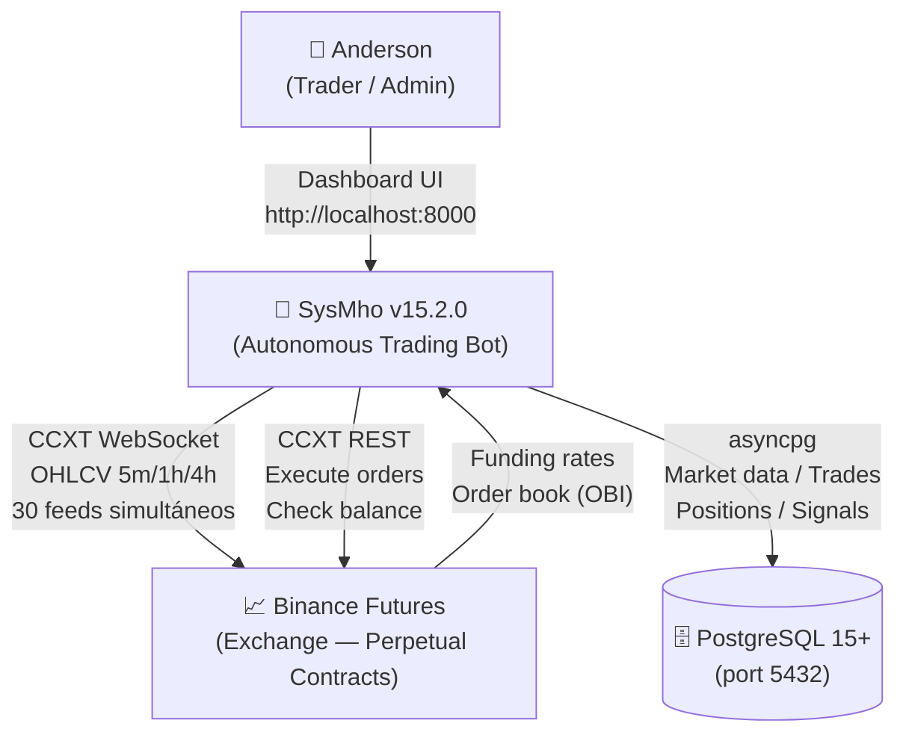

# Arquitectura de SysMho — Modelo C4

**Versión:** 15.2.0 | **Última actualización:** 2026-04-20

---

## Nivel 1 — Contexto del Sistema

Quién usa SysMho y con qué sistemas externos interactúa.



---

## Nivel 2 — Contenedores

Los procesos y almacenamiento que componen SysMho.

```mermaid
graph TB
    Browser["🌐 Browser<br/>(Anderson)"]

    subgraph SysMho["SysMho System (localhost)"]
        Engine["🤖 AI Engine<br/>src/main.py<br/>Python asyncio<br/>6 async loops"]
        Dashboard["📊 Dashboard API<br/>src/dashboard/api.py<br/>FastAPI — port:8000<br/>7 routers / 25+ endpoints"]
        DB[("🗄️ PostgreSQL<br/>8 tables<br/>port:5432")]
        Model["📦 XGBoost Model<br/>src/ai/models/<br/>xgboost_v1_1.joblib<br/>28 features / 3 clases")]
        IPC["📄 IPC Files<br/>src/runtime_state.json<br/>src/sysmho_brain.log"]
    end

    Binance["📈 Binance Futures"]

    Browser -->|"HTTP REST<br/>X-API-Key header"| Dashboard
    Engine <-->|"read/write JSON<br/>(toggle autonomous,<br/>CB reset, last_scan)"| IPC
    Dashboard <-->|"read JSON<br/>(sync_status, logs)"| IPC
    Engine -->|"asyncpg pool"| DB
    Dashboard -->|"asyncpg pool"| DB
    Engine -->|"joblib.load()<br/>at startup"| Model
    Engine -->|"CCXT async WebSocket<br/>(market data)"| Binance
    Engine -->|"CCXT async REST<br/>(orders, balance)"| Binance
```

---

## Nivel 3 — Pipeline de Predicción ML

Flujo completo desde datos crudos hasta ejecución de trade.

```
Binance WebSocket (10 símbolos × 3 timeframes = 30 feeds activos)
    │
    ▼
market_data (PostgreSQL)
    │  OHLCV candles: open_time, open, high, low, close, volume
    │  Timeframes: 5m (predicción) | 1h | 4h (contexto macro)
    │
    ▼
FeatureEngineer.get_master_dataframe()         [src/analysis/features.py]
    ├── TechnicalIndicators.add_all_indicators()
    │       RSI(14), Stochastic RSI, MACD diff%,
    │       ADX(14), +DI, Bollinger Bands %,
    │       ATR%, EMA21 dist%, EMA200 dist%,
    │       VWAP dist%, pct_change, vol_change
    ├── merge_asof(1h data) → 5 macro features h1_*
    ├── merge_asof(4h data) → 5 macro features h4_*
    ├── sentiment_data → funding_rate, obi_20
    ├── Swarm Intelligence (cross-symbol avg) → swarm_rsi_avg, swarm_macd_avg, swarm_bull_ratio
    └── symbol_encoded (BTC=0 .. POL=9, estable)
    = DataFrame con 28 features normalizadas
    │
    ▼
ModelPredictor.predict_signal()                [src/ai/predictor.py]
    ├── XGBoost.predict_proba(features) → [p_SELL, p_WAIT, p_BUY]
    ├── Filtro inercia: p_WAIT > 72% → return WAIT (previene overtrading)
    ├── Clase dominante: argmax(p_BUY, p_SELL)
    ├── Ratio fuerza: p_dominant / p_opposite ≥ 2.0
    └── Confianza mínima: ≥ 38%
    = {signal: "BUY"|"SELL"|"WAIT", confidence: float, signal_type: "PREMIUM"|"STANDARD"}
    │
    ▼  (si signal ≠ WAIT)
RiskManager.evaluate_signal()                  [src/risk/manager.py]
    ├── Position sizing: 2% capital (NORMAL) / 5% (AGGRESSIVE)
    ├── Notional cap: max 12% capital por trade
    ├── Exposure check: alerta si >50% capital en posiciones activas
    └── SL = entry - ATR×1.5 | TP = entry + ATR×3.0
    = {quantity, entry_price, stop_loss, take_profit, invested_usdt, risk_score}
    │
    ▼
┌────────────────── MODO MANUAL ──────────────────────────┐
│  INSERT pending_approvals (status='PENDING')            │
│  Dashboard UI → Anderson: APPROVE o REJECT              │
│  Timeout: 5 minutos → señal descartada automáticamente  │
└─────────────────────────────────────────────────────────┘
    ─ ó ─ (si AUTONOMOUS_MODE=true)
┌────────────────── MODO AUTÓNOMO ────────────────────────┐
│  MetaEvaluator.evaluate()            [src/ai/meta_evaluator.py]
│      ├── Win rate global símbolo (si ≥10 trades)
│      ├── Win rate hora UTC + dirección (si ≥5 trades)
│      ├── Calibración confianza (bucket 0.05)
│      ├── Racha pérdidas recientes (-8% por pérdida extra)
│      └── Confianza base modelo
│      = meta_score [0,1] vs umbral dinámico (0.52 base, cap 0.75)
│  CircuitBreaker.check()              [src/executor/circuit_breaker.py]
│      ├── Drawdown diario ≥ 4%  → BLOCKED
│      ├── Drawdown semanal ≥ 8% → BLOCKED
│      ├── ≥3 pérdidas consecutivas → BLOCKED
│      ├── ≥3 posiciones abiertas → BLOCKED
│      └── ≥8 trades hoy → BLOCKED
└─────────────────────────────────────────────────────────┘
    │ (si APPROVED y CB no bloqueado)
    ▼
TradeExecutor.execute_trade()                  [src/executor/trader.py]
    └── CCXT: exchange.create_order(symbol, 'market', side, amount)
        INSERT trades (status='EXECUTED')
    │
    ▼
PositionMonitor.run()                          [src/executor/monitor.py]
    └── Sync cada 1 segundo: precio actual, PnL no realizado
        SL/TP hit → close position
    │
    ▼ (al cerrar posición)
SelfLearner.update(trade)                      [src/ai/self_learner.py]
    └── Actualiza meta_stats.json:
        win_rate global, by_hour[UTC_DIRECTION], confidence_calibration
```

---

## Database Schema

Definido en `src/database/schema.sql` + 3 migraciones.

| Tabla | Propósito | Índices |
|-------|-----------|---------|
| `market_data` | OHLCV candles (5m/1h/4h) | symbol, timeframe, open_time DESC |
| `sentiment_data` | Funding rate + OBI por símbolo | symbol (UNIQUE) |
| `trades` | Historial completo de operaciones ejecutadas | symbol, executed_at |
| `positions` | Posiciones abiertas activas | symbol (UNIQUE) |
| `pending_approvals` | Señales IA pendientes + historial | status, alert_category, score |
| `portfolio` | Snapshots periódicos de balance | recorded_at |
| `risk_log` | Rechazos del risk manager (auditoría) | created_at |
| `model_performance` | Métricas de cada retraining | trained_at |

---

## IPC (Inter-Process Communication)

Engine y Dashboard se comunican via archivos JSON (sin socket directo):

| Archivo | Escrito por | Leído por | Contenido |
|---------|-------------|-----------|-----------|
| `src/runtime_state.json` | Engine + Dashboard | Ambos | `autonomous_mode`, `last_scan_at`, `sync_status`, `cb_reset_flag` |
| `src/sysmho_brain.log` | Engine | Dashboard (`GET /api/logs`) | Telemetría neuronal línea a línea |

---

## Entry Points

| Proceso | Comando | Puerto |
|---------|---------|--------|
| AI Engine | `uv run engine` | — (sin puerto) |
| Dashboard | `uv run dashboard` | 8000 |
| Retraining | `uv run python -m src.ai.trainer --symbol ALL --timeframe 5m` | — |
| Tests | `uv run test` | — |
| DB migrate | `uv run db-migrate` | — |
